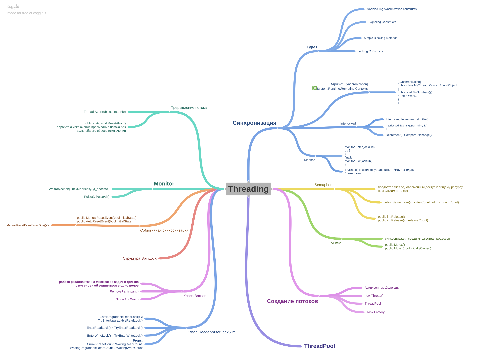

# Threads in .NET

In computing, a **thread** is the smallest unit of execution that can be scheduled by an operating system. A process can contain multiple threads, which can be executed concurrently, sharing the process resources but executing independently.

In .NET, the `Thread` class, part of the `System.Threading` namespace, represents a thread. 

## Table of Contents
- [Threads in .NET](#threads-in-net)
  - [Table of Contents](#table-of-contents)
  - [What is a Thread?](#what-is-a-thread)
  - [Creating and Starting Threads](#creating-and-starting-threads)
  - [Thread States](#thread-states)
  - [Thread Priority](#thread-priority)
  - [Thread Pooling](#thread-pooling)
  - [Thread Synchronization](#thread-synchronization)
  - [Common Uses](#common-uses)

---

## What is a Thread?

- **Single-threaded Execution**: By default, all .NET applications start as a single thread.
  
- **Multithreading**: Involves running multiple threads in parallel. This can be used to improve application responsiveness or to perform parallel computations.

---

## Creating and Starting Threads

You can create a new thread by creating an instance of the `Thread` class and passing a `ThreadStart` delegate or a `ParameterizedThreadStart` delegate if you want to pass parameters.

```csharp
using System;
using System.Threading;

public class Example
{
    public static void Main()
    {
        Thread newThread = new Thread(new ThreadStart(Work));
        newThread.Start();
    }

    public static void Work()
    {
        // Your code here
    }
}
```

---

## Thread States

A thread can be in one of the following states:

- **Unstarted State**: The thread is created but not started.
  
- **Ready State**: The thread is ready to be executed.
  
- **Running State**: The thread is currently being executed.
  
- **WaitSleepJoin State**: The thread is blocked and is waiting for a thread `Join` to finish, a `Monitor` to release, or a task to complete.
  
- **Suspended State**: The thread has been suspended.
  
- **AbortRequested State**: A request has been made to terminate the thread.
  
- **Stopped State**: The thread has been stopped.

---

## Thread Priority

Threads can have different priorities:

- `ThreadPriority.Lowest`
- `ThreadPriority.BelowNormal`
- `ThreadPriority.Normal`
- `ThreadPriority.AboveNormal`
- `ThreadPriority.Highest`

Higher priority threads are scheduled before lower priority ones, but it's generally not recommended to change thread priorities as it can lead to unpredictable behavior.

---

## Thread Pooling

Creating and destroying threads frequently can be resource-intensive. .NET provides a thread pooling mechanism via the `ThreadPool` class which manages the lifecycle of threads efficiently.

---

## Thread Synchronization

When multiple threads access shared data, and at least one thread modifies it, you can have unpredictable results. .NET provides several synchronization primitives to ensure data consistency:

- **Locking**: Using the `lock` keyword.
  
- **Mutex**: Allows multiple threads to synchronize access across different processes.
  
- **Semaphore**: Limits the number of threads that can access a resource or pool of resources concurrently.

- **Monitor**: Provides a mechanism that synchronizes access to objects.

---

## Common Uses

1. **UI Applications**: To keep the UI responsive, long-running tasks like file IO or computations are executed on a separate thread.

2. **Parallel Computations**: Divide a computational task into smaller chunks and process them in parallel.

3. **Server Applications**: Handle multiple client requests concurrently.

4. **Timers**: Execute tasks at specific intervals.

---

Understanding threads is fundamental before diving into higher-level abstractions like `Task` or `async/await` in .NET. While direct thread management (like using the `Thread` class) is now less common due to these abstractions, it's crucial knowledge for any developer aiming to understand the underlying mechanisms.