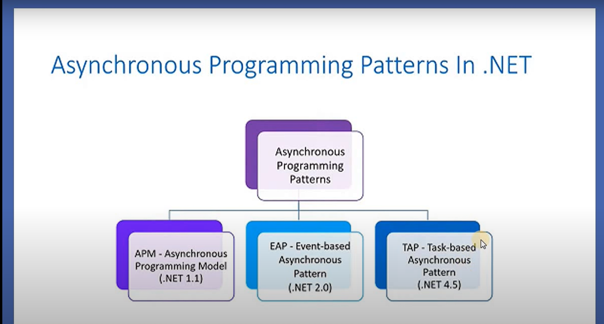

Table of Contents
- [Overview, Goal, and Purpose](#overview-goal-and-purpose)
- [Content](#content)
- [Summary](#summary)

---

### Overview, Goal, and Purpose
The main idea of asynchronous programming is to initiate separate method calls and simultaneously continue performing other tasks without waiting for the completion of those calls. Local methods, which have a minimized likelihood of exceptions, do not require an asynchronous approach (for example, changing the text's font color or size). However, other methods (like waiting for a file to be read or initiating a web service) demand it right at the start of development. The Common Language Runtime environment supports a vast array of asynchronous programming methods and classes.

---

### Content
1. Thread Pool
2. Pattern of Asynchronous Method Invocation
3. Asynchronous Nature of Delegates
4. IAsyncResult Interface
5. Synchronization of the Calling Thread
6. AsyncCallback Delegate
7. AsyncResult Class
8. Transmission and Reception of Special State Data

---
## Async Patterns

---

### Summary
- Classes that have built-in support for the asynchronous model possess a pair of asynchronous methods for each of their synchronous methods. These methods start with the words `Begin` and `End`. For instance, if one wishes to utilize the asynchronous variant of the `Read` method from the `System.IO.Stream` class, they need to employ the `BeginRead` and `EndRead` methods of that same class.
- To utilize the built-in support for the asynchronous programming model, one should invoke the corresponding `BeginOperation` method and select the call completion model. The `BeginOperation` method returns an `IAsyncResult` object, which can be used to determine the state of the asynchronous operation's execution.
- The `EndOperation` method is applied to conclude an asynchronous call in scenarios where the main thread has to undertake a significant amount of computations, independent of the results of the asynchronous method call. Once the primary task is completed and the application requires the results of the asynchronous method for further actions, the `EndOperation` method is invoked. At this point, the main thread will be suspended until the asynchronous method concludes its operation.
- The `Callback` method of concluding an asynchronous call is employed in situations where there's a need to prevent the main thread from being blocked. When using `Callback`, the `EndOperation` method is initiated within the body of a method that gets invoked upon the completion of a method operating in a parallel thread. The signature of the invoked method must align with the `AsyncCallback` delegate's signature.
- Invoking asynchronous delegates allows for the implicit placement of threads into the ThreadPool, thereby relieving the programmer from the need to interact with it directly.
- The signature of the `BeginInvoke` method does not match the `Invoke` method. This discrepancy arises because there needs to be a way to identify a specific work item that has just been deferred by the `BeginInvoke` call. As such, `BeginInvoke` returns a reference to an object implementing the `IAsyncResult` interface. This object acts like a cookie set, preserved for identifying the executing work item. Through the methods of the `IAsyncResult` interface, one can check the operation's status, such as its readiness.
- When the thread requested to execute the operation completes its task, it invokes `EndInvoke` on the delegate. However, since the method needs a way to identify the asynchronous operation whose result needs to be retrieved, it must be passed the object obtained from the `BeginInvoke` method.
- If an exception is generated during the asynchronous execution of the target code of the delegate in the thread pool, it will be re-generated when the initiating thread calls `EndInvoke`.
- The thread pool offers the following advantages:
  o The thread pool manages threads efficiently, reducing the number of threads that are created, started, and stopped.
  o By using the thread pool, one can focus on solving the task at hand rather than the application's thread infrastructure.
- Situations where manual thread management is preferable:
  o If foreground threads are needed, or a thread's priority needs to be set. Note: Threads from the pool are always background threads with a default priority (`ThreadPriority.Normal`).
  o If a thread with a fixed identity is required, allowing it to be interrupted or found by name.
- The `IAsyncResult` interface is implemented using classes containing methods that can operate asynchronously. The object facilitating the `IAsyncResult` interface's operation stores information about the state of the asynchronous operation and provides a synchronization object signaling the thread upon the operation's completion.
- The `AsyncCallback` delegate is used for processing the results of an asynchronous operation in a separate thread. The `AsyncCallback` delegate represents a callback method that is invoked upon the completion of an asynchronous operation. The callback method accepts an `IAsyncResult` parameter, which is subsequently used to retrieve the results of the asynchronous operation.
- The `AsyncResult` class is used in conjunction with asynchronous method calls using delegates. The `IAsyncResult` returned from the delegate's `BeginInvoke` method can be cast to `AsyncResult`. `AsyncResult` has an `AsyncDelegate` property containing the delegate object to which the asynchronous call was directed.

---