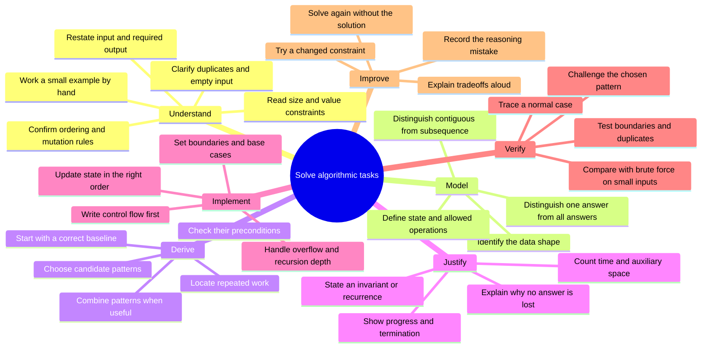
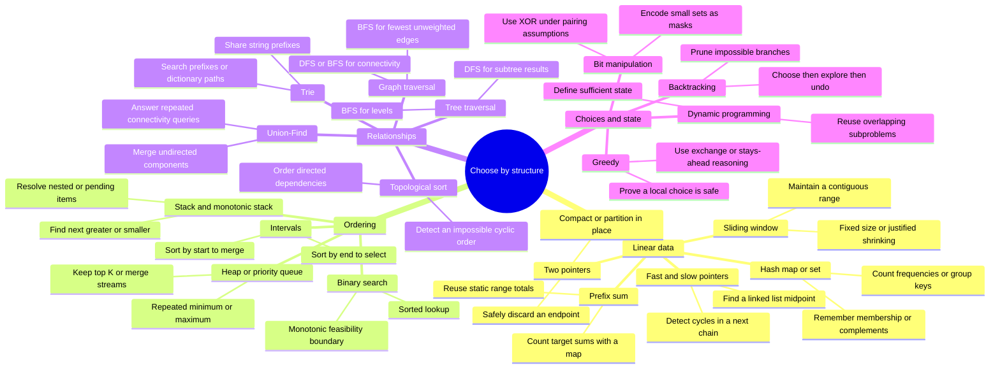
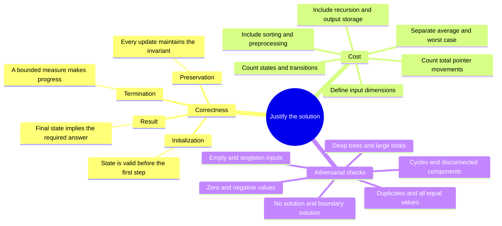

# Algorithm Problem-Solving Mind Map

Use this study map to move from understanding a task to deriving, proving, implementing, and testing a solution. It synthesizes the [Algorithm Problem-Solving Guide](algorithm-problem-solving.md) and all 18 pages in the [Algorithm Patterns Catalogue](patterns/index.md).

The maps separate the solving process from the pattern library so each stays readable. Pattern names are hypotheses: confirm their preconditions before choosing an algorithm.

## 1. The solving process

Before coding, complete this sentence: **“My state represents __; each step preserves __; progress is __; the result is correct because __.”** If you cannot fill it in, return to a small example or the baseline solution.

## 2. Pattern selection

### Selection guardrails and supporting pages

| Candidate | Evidence that supports it | Check before committing |
|---|---|---|
| [Hash map / set](patterns/hash-map-set.md) | Repeated membership, complement, or frequency queries | Lookup is average constant time for bounded-size keys; account for hashing long strings and storing keys. |
| [Two pointers](patterns/two-pointers.md) | A pointer movement safely eliminates candidates, or separates read/write positions | Sorting is not always needed. If you sort, count its cost and preserve original indices when required. |
| [Sliding window](patterns/sliding-window.md) | A contiguous range with incrementally maintained state | Fixed-size sums work with negatives; sum-based variable shrinking needs additional conditions. Contiguity alone is insufficient. |
| [Prefix sum](patterns/prefix-sum.md) | Repeated static range sums or counting subarrays of target sum | Use `prefix[j + 1] - prefix[i]`; seed a counting map with zero occurring once. Frequent updates need another structure. |
| [Fast / slow pointers](patterns/fast-slow-pointers.md) | A linked list or deterministic next-state chain | Check null boundaries; general branching graphs require other cycle-detection methods. |
| [Binary search](patterns/binary-search.md) | Sorted lookup or a monotonic predicate | Define the interval convention and prove every update preserves candidates and shrinks the interval. |
| [Stack / monotonic stack](patterns/stack-monotonic.md) | Nesting or unresolved nearest-greater/smaller queries | Decide how equal values behave and whether to store indices or values. |
| [Heap](patterns/heap-priority-queue.md) | Repeated extrema or a bounded top-K set | For K largest, keep a min-heap of size K. A heap is not a fully sorted sequence. |
| [Intervals](patterns/intervals.md) | Overlaps, scheduling, or simultaneous resource use | Decide whether touching endpoints overlap. Merge by start; unweighted maximum compatible selection uses earliest finish. |
| [Tree traversal](patterns/tree-traversal.md) | Parent-child structure or subtree aggregation | Inorder is sorted only for a BST. An undirected tree adjacency list still needs parent tracking or visited state. |
| [Graph traversal](patterns/graph-traversal.md) | Reachability, components, or shortest hops | BFS shortest-path reasoning assumes unweighted or equal positive edge costs. Dijkstra requires nonnegative weights. |
| [Topological sort](patterns/topological-sort.md) | Directed prerequisites | A complete order exists only for a DAG; with Kahn's algorithm, verify all vertices were processed. |
| [Union-Find](patterns/union-find.md) | Repeated component merges and connectivity queries | Standard DSU does not return paths, support arbitrary deletions, or solve directed reachability. |
| [Trie](patterns/trie.md) | Repeated prefix queries | Ordinary lookup scales with query length; wildcard branching and enumerating completions add work. |
| [Backtracking](patterns/backtracking.md) | Explicit candidate exploration with reversible choices | Restore state, copy saved results, and account for output size. Decision tasks can also use backtracking. |
| [Dynamic programming](patterns/dynamic-programming.md) | Repeated states with reusable answers | Define state, transition, base cases, and evaluation order. “Minimum” or “count” alone does not establish DP. |
| [Greedy](patterns/greedy.md) | A locally preferred choice can be proved safe globally | Search for a counterexample. Failure of greedy does not automatically establish a practical DP solution. |
| [Bit manipulation](patterns/bit-manipulation.md) | Fixed-width flags, subset states, or cancellation | Check width, signedness, and multiplicities; XOR cancellation is not a general duplicate detector. |

## 3. Correctness and complexity

Use the cost model for the algorithm you actually wrote:

| Structure | Typical bound and assumptions |
|---|---|
| One-pass hashing | Average `O(n)` time and up to `O(n)` auxiliary space for bounded-size keys. |
| Two-pointer or window scan | `O(n)` if both pointers only advance and each update is constant time; add any sorting cost. |
| Binary search on answers | `O(C log R)` where `R` is the number of integer candidates and `C` is one feasibility-check cost. |
| Monotonic stack | `O(n)` total pushes and pops, even though a step can pop many entries. |
| Bounded heap | `O(n log(k + 1))` time and `O(k)` space for maintaining up to K items. |
| Adjacency-list traversal | `O(V + E)` time; include visited state, frontier, and graph storage separately. |
| Tree traversal | `O(n)` time; DFS stack `O(h)` or BFS queue `O(w)`, for height `h` and maximum width `w`. |
| Dynamic programming | Number of computed states times work per state; stored states plus any recursion stack determine space. |
| Enumeration | Include the number and length of emitted answers; pruning does not guarantee polynomial time. |

For sorting tradeoffs, consult [Sorting Algorithms Notes](Sorting/sort-algorithms.md): compare stability, auxiliary memory, and worst-case behavior. Do not describe an entire sort-then-scan solution as linear just because its final scan is linear.

## 4. Learn through contrasts

These examples turn the guide's signal words into decisions you can defend.

| Task or changed constraint | Derivation and correctness checkpoint |
|---|---|
| Two Sum, unsorted input, original indices required | Replace repeated complement searches with a map. Look up before inserting so one position cannot pair with itself; `[3, 3]` with target `6` must still succeed. |
| Two Sum, already sorted | Move the left pointer when the sum is too small and the right when too large. Explain why the discarded endpoint cannot produce a solution with the remaining candidates. |
| Longest substring without repeats | Keep a duplicate-free window. For `abba`, the left boundary must never move backward when an old character reappears. |
| Count subarrays of sum K, negatives allowed | Use prefix-frequency lookup. With `[1, -1, 1]` and K = `1`, there are three answers; sum is not monotonic under expanding or shrinking. |
| Search a sorted array | Maintain the possible target interval. Test empty input, first/last position, a missing target, and the final one-element interval. |
| Number of Islands | Treat land as graph vertices. Each new traversal marks one whole component; confirm adjacency rules and whether mutating the grid is permitted. |
| Coin Change with arbitrary positive denominations | Largest-first greedy fails for `[1, 3, 4]`, amount `6`: `4 + 1 + 1` loses to `3 + 3`. Define DP by remaining amount, with zero as the base case. |
| Course Schedule | Model prerequisites as directed edges. A plain visited flag is insufficient for DFS cycle detection; use active/completed states or Kahn's indegrees. |

One detail to watch in the original guide: its longest-substring implementation retains **all distinct characters seen so far** in `lastSeen`, including characters outside the current window. Its space bound is therefore `O(d)` for distinct characters seen in the input, rather than only those currently in the window.

## 5. Practice toward independent solving

Use this progression as a suggested study plan, advancing when you can explain the reasoning without a pattern label or reference solution.

| Stage | Practice from the supporting pages | Evidence of understanding |
|---|---|---|
| Linear state | Two Sum; Valid Palindrome; Longest Substring Without Repeating Characters; Subarray Sum Equals K | Explain what is remembered, why boundaries move, and when a window fails. |
| Ordering and pending work | Binary Search; Daily Temperatures; Kth Largest Element; Merge Intervals | Defend interval boundaries, stack order, heap direction, and endpoint semantics. |
| Relationships | Maximum Depth; Number of Islands; Course Schedule; Redundant Connection; Implement Trie; Linked List Cycle | Choose traversal, dependency ordering, component merging, prefix lookup, or chain-cycle detection from the required output. |
| Choices and reuse | Subsets; House Robber; Coin Change; Non-overlapping Intervals; Single Number | Distinguish enumeration, repeated state, provably safe choices, and cancellation assumptions. |
| Mixed transfer | Top K Frequent Elements; Word Search II; Capacity To Ship Packages Within D Days | Combine hashing with a heap, a trie with backtracking, or binary search with a feasibility scan. |

For each practice problem:

1. Write the contract, a hand-worked example, and a baseline with complexity.
2. Propose a pattern and explicitly rule out one plausible alternative.
3. State the invariant or recurrence, then implement without copying a template.
4. Test a normal case, a boundary case, and a case designed to break your assumption. Where practical, compare with brute force over many small inputs.
5. Record the specific obstacle: modeling, pattern selection, proof, implementation, or complexity.
6. Re-solve after a delay without notes, then change a constraint: sorted input, streaming data, less memory, or all answers.

When stuck, reduce the input, enumerate possibilities by hand, identify repeated work, and ask what information would make the next decision cheap. After using a hint, close it and reconstruct the reasoning yourself.

### Mastery checklist

- [ ] I can restate the contract and identify the constraints that matter.
- [ ] I can derive a correct baseline and explain its bottleneck.
- [ ] I can select a pattern from its preconditions, not just a keyword.
- [ ] I can state why each discarded candidate is safe to discard.
- [ ] I can justify termination, time, and auxiliary space.
- [ ] I can build counterexamples and test boundary behavior.
- [ ] I can solve an unfamiliar variation and explain the tradeoffs aloud.
