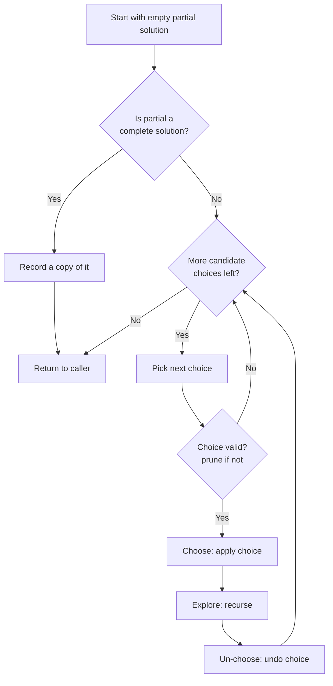

# Backtracking Pattern

Use backtracking when you must **build every candidate solution incrementally** and can abandon a partial candidate the moment it can no longer lead to a valid answer.

## When To Pick This Pattern

Reach for backtracking when you notice:

- the problem asks for **all** subsets, permutations, combinations, or arrangements
- you build a solution one choice at a time and each choice constrains later ones
- "generate every valid configuration" (`N-Queens`, `Sudoku`, grid word search)
- the answer is a set of sequences rather than a single number
- constraints let you cut off whole branches early (pruning)

Ask yourself:

> "Can I make a choice, recurse on the smaller problem, then **undo the choice** and try the next one?"

### Backtracking vs Related Approaches

| Situation | Approach |
|---|---|
| enumerate all valid configurations | backtracking |
| only need the count or the best value, with overlap | [dynamic programming](dynamic-programming.md) |
| single locally optimal choice suffices | [greedy](greedy.md) |
| explore states level by level for shortest path | BFS |

### When NOT To Use It

- you only need the **number** of solutions or an optimal value, not the solutions themselves — DP is usually faster
- the search space is enormous with no effective pruning — exponential blowup
- a direct formula or greedy rule gives the answer
- subproblems overlap heavily — memoize instead of re-exploring

## Algorithm

The template is **choose -> explore -> un-choose**: apply a choice to the current partial solution, recurse, then revert the choice so the next sibling branch starts clean. Prune by returning early whenever the partial solution violates a constraint.



**Pruning** is the whole game: the earlier you detect that a branch cannot succeed, the more of the exponential tree you skip. Common cuts: skip duplicates, enforce a non-decreasing index to avoid reordered repeats, bail when a running sum exceeds the target, and check column/diagonal conflicts before placing a queen.

## Code (C#)

### Subsets — the canonical choose/explore/un-choose shape

```csharp
// Returns every subset (the power set) of a distinct-value array.
// Time:  O(n * 2^n) - 2^n subsets, each up to length n to copy.
// Space: O(n) recursion depth, excluding the output.
public static IList<IList<int>> Subsets(int[] nums)
{
    var result = new List<IList<int>>();
    var path = new List<int>();

    void Backtrack(int start)
    {
        // Every node in the tree is itself a valid subset.
        result.Add(new List<int>(path));

        // 'start' enforces increasing index so we never reorder picks.
        for (int i = start; i < nums.Length; i++)
        {
            path.Add(nums[i]);   // choose
            Backtrack(i + 1);    // explore the rest
            path.RemoveAt(path.Count - 1); // un-choose
        }
    }

    Backtrack(0);
    return result;
}
```

### Permutations — track what is already used

```csharp
// Returns all orderings of a distinct-value array.
// Time:  O(n * n!), Space: O(n) for the used[] and recursion.
public static IList<IList<int>> Permute(int[] nums)
{
    var result = new List<IList<int>>();
    var path = new List<int>();
    var used = new bool[nums.Length];

    void Backtrack()
    {
        if (path.Count == nums.Length)
        {
            result.Add(new List<int>(path));
            return;
        }

        for (int i = 0; i < nums.Length; i++)
        {
            if (used[i]) continue; // prune: each element once per permutation

            used[i] = true;
            path.Add(nums[i]);      // choose
            Backtrack();            // explore
            path.RemoveAt(path.Count - 1); // un-choose
            used[i] = false;
        }
    }

    Backtrack();
    return result;
}
```

### Combination Sum — pruning with a running total

```csharp
// All combinations of candidates (reusable) that sum to target.
// Time:  exponential in the target/candidate ratio; Space: O(target) depth.
public static IList<IList<int>> CombinationSum(int[] candidates, int target)
{
    var result = new List<IList<int>>();
    var path = new List<int>();
    Array.Sort(candidates); // lets us break as soon as a candidate overshoots

    void Backtrack(int start, int remaining)
    {
        if (remaining == 0)
        {
            result.Add(new List<int>(path));
            return;
        }

        for (int i = start; i < candidates.Length; i++)
        {
            // Prune: sorted, so every later candidate also overshoots.
            if (candidates[i] > remaining) break;

            path.Add(candidates[i]);         // choose
            Backtrack(i, remaining - candidates[i]); // i (not i+1): reuse allowed
            path.RemoveAt(path.Count - 1);   // un-choose
        }
    }

    Backtrack(0, target);
    return result;
}
```

## Practice Tasks

Work these in rough order of difficulty:

1. **Subsets** — enumerate the power set. (choose/skip each index)
2. **Combinations** — all k-length picks from 1..n. (advance start index)
3. **Permutations** — all orderings of distinct values. (used[] flag)
4. **Combination Sum** — sums to target with reuse. (prune on running total)
5. **Subsets II** — power set with duplicates. (sort, skip equal siblings)
6. **Palindrome Partitioning** — split a string into palindromes. (validate each prefix before recursing)
7. **Word Search** — find a word in a grid. (DFS with visited marking, un-mark on return)
8. **N-Queens** — place n non-attacking queens. (track columns and both diagonals to prune)
9. **Sudoku Solver** — fill the board. (try 1-9 per empty cell, undo on failure)

## Related Patterns

- [Dynamic Programming](dynamic-programming.md) — when you need a count or optimum over overlapping subproblems, not every solution.
- [Greedy](greedy.md) — when one locally optimal choice replaces the whole search.
- [Hash Map / Hash Set](hash-map-set.md) — often used inside backtracking to track visited states or skip duplicates.
