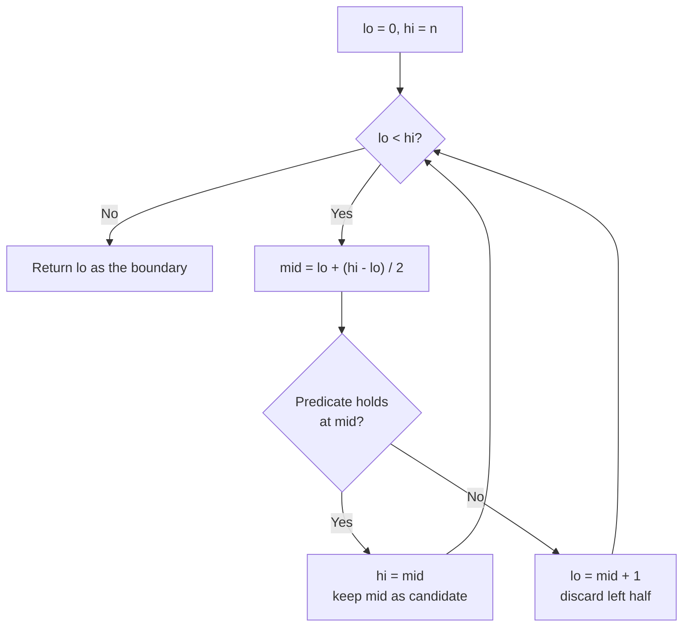

# Binary Search Pattern

Use binary search when a **sorted or monotonic** search space lets you throw away half the candidates with every comparison, turning an `O(n)` scan into `O(log n)`.

## When To Pick This Pattern

Reach for binary search when you notice:

- a **sorted** array and you need a position, a value, or a boundary
- the classic "find the smallest / largest value that satisfies a condition"
- a monotonic predicate: once it flips `false -> true` it never flips back
- "minimize the maximum" / "maximize the minimum" phrasing (binary search on the answer)
- first/last occurrence of a duplicated value
- a rotated sorted array where one half is always still sorted

Ask yourself:

> "Can I define a check that is `false, false, ..., false, true, true, ..., true` over the range? If so, I can binary search for the flip."

| Problem shape | What you search over |
|---|---|
| value exists in sorted array | array indices |
| first/last index of a value | array indices, biased left/right |
| min capacity / speed / size that works | the **answer range**, not the array |
| rotated sorted array | indices, deciding which half is sorted |

### When NOT To Use It

- the data is unsorted and cannot be cheaply made monotonic
- the "check" for a candidate answer is not monotonic (a working value with a smaller failing value above it)
- the input is tiny — a linear scan is simpler and just as fast
- you need every match, not a boundary — binary search finds one edge, not all

## Algorithm

Maintain a `[lo, hi]` window, probe the middle, and discard the half that cannot contain the answer. The **lower-bound** template below finds the first index whose value is `>= target`; almost every variant is a tweak of it.



Key discipline: pick your **invariant** and keep it. Use `hi = mid` when `mid` might still be the answer, and `lo = mid + 1` when `mid` is definitely too small. Compute `mid` as `lo + (hi - lo) / 2` to avoid overflow.

## Code (C#)

### Lower bound — the template to memorize

```csharp
// Returns the first index i where nums[i] >= target
// (i.e. the insertion point). Range is [0, n].
// Time:  O(log n).
// Space: O(1).
public static int LowerBound(int[] nums, int target)
{
    int lo = 0, hi = nums.Length; // hi is exclusive: n means "past the end".

    while (lo < hi)
    {
        int mid = lo + (hi - lo) / 2; // overflow-safe midpoint.

        if (nums[mid] < target)
        {
            lo = mid + 1;             // mid too small, answer is to the right.
        }
        else
        {
            hi = mid;                 // mid might be the boundary, keep it in range.
        }
    }

    return lo; // lo == hi == first index with value >= target.
}
```

### First and last occurrence

```csharp
// Finds the inclusive [first, last] index range of target, or [-1, -1].
// Time: O(log n), Space: O(1).
public static int[] SearchRange(int[] nums, int target)
{
    int first = LowerBound(nums, target);
    // If target is absent, first points at a value != target (or off the end).
    if (first == nums.Length || nums[first] != target)
    {
        return new[] { -1, -1 };
    }

    // Last occurrence = (lower bound of target + 1) - 1.
    int last = LowerBound(nums, target + 1) - 1;
    return new[] { first, last };
}
```

### Binary search on the answer — Koko eating bananas

```csharp
// Minimum eating speed so all piles are finished within h hours.
// The predicate "can finish at speed s" is monotonic: faster never hurts.
// Time:  O(n log maxPile) - a feasibility scan per binary-search step.
// Space: O(1).
public static int MinEatingSpeed(int[] piles, int h)
{
    int lo = 1, hi = piles.Max(); // slowest useful speed .. fastest ever needed.

    while (lo < hi)
    {
        int mid = lo + (hi - lo) / 2;

        if (CanFinish(piles, mid, h))
        {
            hi = mid;      // feasible: try to go slower.
        }
        else
        {
            lo = mid + 1;  // too slow: must speed up.
        }
    }

    return lo; // smallest feasible speed.

    // Hours needed at speed s: ceil(pile / s) summed over piles.
    static bool CanFinish(int[] piles, int s, int h)
    {
        long hours = 0;
        foreach (int p in piles)
        {
            hours += (p + s - 1) / s; // integer ceiling division.
        }
        return hours <= h;
    }
}
```

### Search in a rotated sorted array

```csharp
// Finds target in a rotated ascending array of distinct values, or -1.
// One half of [lo, hi] is always sorted; decide which and narrow accordingly.
// Time: O(log n), Space: O(1).
public static int SearchRotated(int[] nums, int target)
{
    int lo = 0, hi = nums.Length - 1;

    while (lo <= hi)
    {
        int mid = lo + (hi - lo) / 2;

        if (nums[mid] == target) return mid;

        if (nums[lo] <= nums[mid]) // left half [lo, mid] is sorted.
        {
            if (nums[lo] <= target && target < nums[mid]) hi = mid - 1;
            else lo = mid + 1;
        }
        else                        // right half [mid, hi] is sorted.
        {
            if (nums[mid] < target && target <= nums[hi]) lo = mid + 1;
            else hi = mid - 1;
        }
    }

    return -1;
}
```

## Practice Tasks

Work these in rough order of difficulty:

1. **Binary Search** — find a target in a sorted array. (the plain template)
2. **Search Insert Position** — index where target is or would go. (this is lower bound)
3. **First Bad Version** — first failing version via an API. (monotonic predicate)
4. **Find First and Last Position** — occurrence range of a value. (two lower-bound calls)
5. **Koko Eating Bananas** — min speed to finish in `h` hours. (binary search on the answer)
6. **Capacity To Ship Packages Within D Days** — min ship capacity. (feasibility check on capacity)
7. **Search in Rotated Sorted Array** — find target in a rotated array. (which half is sorted)
8. **Find Minimum in Rotated Sorted Array** — the pivot value. (compare mid to hi)
9. **Median of Two Sorted Arrays** — median in `O(log(m+n))`. (binary search on the partition)

## Related Patterns

- [Two Pointers](two-pointers.md) — the other main way to exploit sorted input.
- [Sorting](sorting.md) — sort first, then binary search repeatedly.
- [Heap / Priority Queue](heap-priority-queue.md) — an alternative for "kth" and selection problems.
