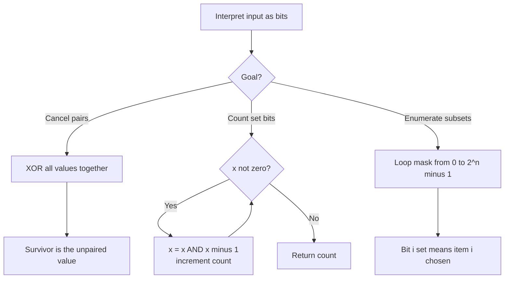

# Bit Manipulation Pattern

Use bit manipulation when values can be treated as **fixed-width sequences of bits**, letting you replace arithmetic or set operations with fast `O(1)` bitwise logic.

## When To Pick This Pattern

Reach for bit tricks when you notice:

- pairing/cancellation of duplicates (`XOR` collapses matched pairs)
- a small set of items (<= ~20) you want to represent as a **bitmask**
- checking powers of two, parity, or individual flags
- counting set bits (population count / Hamming weight)
- "do it without extra space" or "without the `+` operator" style constraints
- enumerating all subsets of a small set

Ask yourself:

> "Can I encode this state in the bits of a single integer and manipulate it with AND/OR/XOR/shifts?"

### Operator Cheat Sheet

| Operation | Effect |
|---|---|
| `x & y` | 1 where **both** bits are 1 — masking, test a bit |
| `x \| y` | 1 where **either** bit is 1 — set a bit |
| `x ^ y` | 1 where bits **differ** — toggle, cancel pairs |
| `~x` | flip all bits |
| `x << k` | shift left, multiply by `2^k` |
| `x >> k` | shift right, divide by `2^k` |
| `x & (x - 1)` | clears the lowest set bit |
| `x & (-x)` | isolates the lowest set bit |
| `x & (1 << i)` | tests whether bit `i` is set |

### When NOT To Use It

- clarity matters more than the micro-optimization — bit tricks are terse and error-prone
- the value range exceeds the integer width (need `> 64` flags) — use a `HashSet` or `bool[]`
- you need ordered iteration or non-power-of-two structure
- signed-shift and overflow subtleties would introduce bugs — prefer plain arithmetic

## Algorithm

Most bit problems either **fold** a sequence with `XOR`/`OR`, or **iterate over set bits** by repeatedly clearing the lowest one.



## Code (C#)

### Single Number — XOR cancels every pair

```csharp
// Every value appears twice except one; return the loner.
// XOR is associative/commutative and x ^ x == 0, so pairs vanish.
// Time: O(n), Space: O(1).
public static int SingleNumber(int[] nums)
{
    int acc = 0;
    foreach (int x in nums)
    {
        acc ^= x; // duplicates cancel, the unique value remains
    }
    return acc;
}
```

### Count Set Bits — clear the lowest set bit each step

```csharp
// Number of 1-bits (Hamming weight) of an unsigned value.
// x & (x - 1) removes the lowest set bit, so we loop once per set bit.
// Time: O(number of set bits), Space: O(1).
public static int HammingWeight(uint x)
{
    int count = 0;
    while (x != 0)
    {
        x &= x - 1; // drop the lowest 1-bit
        count++;
    }
    return count;
}
```

### Power of Two — one bit, no more

```csharp
// True when n is a positive power of two (exactly one bit set).
// A power of two ANDed with its predecessor is always 0.
// Time: O(1), Space: O(1).
public static bool IsPowerOfTwo(int n)
{
    return n > 0 && (n & (n - 1)) == 0;
}
```

### Bitmask Subsets — enumerate the power set with an integer

```csharp
// Returns every subset of a small array using a bitmask counter.
// Bit i of 'mask' decides whether nums[i] is included.
// Time: O(n * 2^n), Space: O(1) excluding the output.
public static IList<IList<int>> Subsets(int[] nums)
{
    int n = nums.Length;
    var result = new List<IList<int>>();

    // Each integer 0..2^n - 1 encodes one distinct subset.
    for (int mask = 0; mask < (1 << n); mask++)
    {
        var subset = new List<int>();
        for (int i = 0; i < n; i++)
        {
            // Is bit i set in this mask?
            if ((mask & (1 << i)) != 0)
            {
                subset.Add(nums[i]);
            }
        }
        result.Add(subset);
    }

    return result;
}
```

## Practice Tasks

Work these in rough order of difficulty:

1. **Number of 1 Bits** — count set bits. (`x & (x-1)` loop)
2. **Single Number** — the one unpaired value. (XOR fold)
3. **Power of Two** — is n a power of two? (`n & (n-1)` test)
4. **Counting Bits** — set bits for every i in 0..n. (`dp[i] = dp[i >> 1] + (i & 1)`)
5. **Reverse Bits** — reverse a 32-bit integer. (shift out low bit, shift into result)
6. **Missing Number** — the absent value in 0..n. (XOR indices with values)
7. **Single Number II** — every value thrice except one. (count bits mod 3, or bit-state machine)
8. **Subsets** — power set of a small array. (bitmask enumeration)
9. **Sum of Two Integers** — add without `+`. (XOR for sum, AND-shift for carry, loop)

## Related Patterns

- [Hash Map / Hash Set](hash-map-set.md) — the general-purpose alternative when values exceed integer width or aren't small.
- [Backtracking](backtracking.md) — bitmasks compactly track visited/used state during a search.
- [Dynamic Programming](dynamic-programming.md) — bitmask DP encodes subsets-as-states for problems like the traveling salesman.
