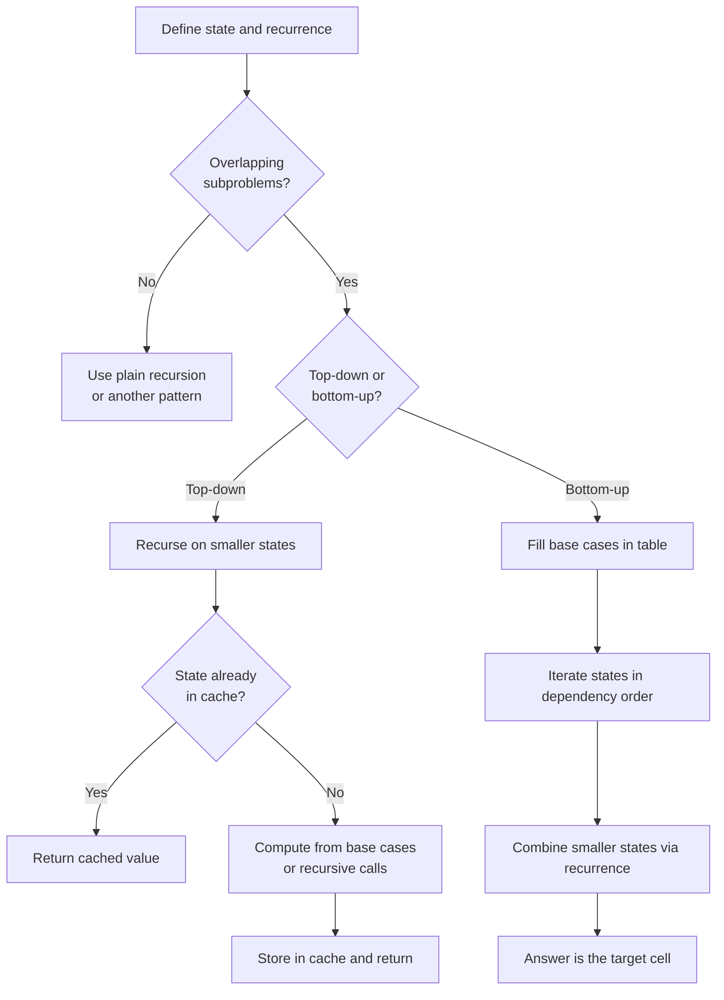

# Dynamic Programming Pattern

Use dynamic programming (DP) when a problem breaks into **overlapping subproblems** whose answers combine through a fixed recurrence, so you solve each subproblem once and reuse it.

## When To Pick This Pattern

Reach for DP when you notice **both** of these properties:

- **Optimal substructure** — the optimal answer is built from optimal answers to smaller subproblems.
- **Overlapping subproblems** — a naive recursion revisits the same subproblem many times.

Concrete signals:

- "count the number of ways" to do something
- "find the minimum / maximum" cost, length, or value over choices
- "is it possible" to reach a target (yes/no with choices)
- a plain recursion is correct but exponential (`O(2^n)`) because of repeated work
- each step offers a small set of choices (take/skip, pick a coin, move right/down)

Ask yourself:

> "Does my recursion call the same arguments again and again — and can I define the answer for state `n` in terms of smaller states?"

### The Decision Framework

1. **Define the state.** What minimal set of variables identifies a subproblem? (e.g. `dp[i]` = best answer using the first `i` items; `dp[i][j]` = answer for prefixes of length `i` and `j`.)
2. **Write the recurrence.** How does the answer at a state depend on smaller states?
3. **Set the base cases.** The smallest states you can answer directly.
4. **Choose a direction.** Top-down memoization or bottom-up tabulation (below).
5. **Optimize space** if only the last row/few states are ever read.

### Top-Down vs Bottom-Up

| | Top-down (memoization) | Bottom-up (tabulation) |
|---|---|---|
| Form | recursion + cache | iterative fill of a table |
| Order | driven by the recursion, lazy | you define the fill order |
| Pros | mirrors the recurrence, computes only reachable states | no recursion overhead, easy space optimization |
| Cons | call-stack depth, cache overhead | must know a valid evaluation order |

### When NOT To Use It

- a **greedy** local choice provably gives the optimum — see [greedy](greedy.md); DP would be needless overhead
- subproblems **don't overlap** — plain divide-and-conquer or recursion suffices
- you must list **every** solution, not count or optimize — use [backtracking](backtracking.md)
- the state space is too large to store (memory blows up) and can't be compressed

## Algorithm

Identify the state and recurrence first; the code is then either a memoized recursion or a table fill.



## Code (C#)

### 1D DP — House Robber (bottom-up, then space-optimized)

```csharp
// Max sum of non-adjacent houses.
// State:      dp[i] = best loot considering houses 0..i-1.
// Recurrence: dp[i] = max(dp[i-1], dp[i-2] + nums[i-1]).
// Time: O(n), Space: O(1) - only the last two states matter.
public static int Rob(int[] nums)
{
    int prev = 0;  // dp[i-2]
    int curr = 0;  // dp[i-1]

    foreach (int house in nums)
    {
        // Either skip this house (curr) or take it plus dp[i-2].
        int take = prev + house;
        int next = Math.Max(curr, take);
        prev = curr;
        curr = next;
    }

    return curr;
}
```

### 1D DP — Coin Change (bottom-up minimum)

```csharp
// Fewest coins summing to amount, or -1 if impossible.
// State:      dp[a] = min coins to make amount a.
// Recurrence: dp[a] = min over coins c of dp[a - c] + 1.
// Time: O(amount * coins), Space: O(amount).
public static int CoinChange(int[] coins, int amount)
{
    int impossible = amount + 1; // sentinel larger than any real answer
    var dp = new int[amount + 1];
    Array.Fill(dp, impossible);
    dp[0] = 0; // base case: zero coins make amount 0

    for (int a = 1; a <= amount; a++)
    {
        foreach (int c in coins)
        {
            if (c <= a && dp[a - c] + 1 < dp[a])
            {
                dp[a] = dp[a - c] + 1;
            }
        }
    }

    return dp[amount] > amount ? -1 : dp[amount];
}
```

### 2D DP — Longest Common Subsequence (top-down memoization)

```csharp
// Length of the longest subsequence common to a and b.
// State:      solve(i, j) = LCS length of a[i..] and b[j..].
// Recurrence: match -> 1 + solve(i+1, j+1);
//             else   -> max(solve(i+1, j), solve(i, j+1)).
// Time: O(m*n), Space: O(m*n) cache + recursion depth.
public static int LongestCommonSubsequence(string a, string b)
{
    var memo = new int?[a.Length, b.Length];

    int Solve(int i, int j)
    {
        if (i == a.Length || j == b.Length) return 0; // base: empty suffix
        if (memo[i, j] is int cached) return cached;

        int result;
        if (a[i] == b[j])
        {
            result = 1 + Solve(i + 1, j + 1);
        }
        else
        {
            result = Math.Max(Solve(i + 1, j), Solve(i, j + 1));
        }

        memo[i, j] = result;
        return result;
    }

    return Solve(0, 0);
}
```

### 2D DP — Edit Distance (bottom-up tabulation)

```csharp
// Min insert/delete/replace operations to turn a into b.
// State:      dp[i][j] = edits to convert a[0..i) into b[0..j).
// Time: O(m*n), Space: O(m*n) (compressible to O(n)).
public static int MinDistance(string a, string b)
{
    int m = a.Length, n = b.Length;
    var dp = new int[m + 1, n + 1];

    // Base cases: converting to/from an empty string.
    for (int i = 0; i <= m; i++) dp[i, 0] = i; // delete all
    for (int j = 0; j <= n; j++) dp[0, j] = j; // insert all

    for (int i = 1; i <= m; i++)
    {
        for (int j = 1; j <= n; j++)
        {
            if (a[i - 1] == b[j - 1])
            {
                dp[i, j] = dp[i - 1, j - 1]; // characters match, no cost
            }
            else
            {
                // 1 + best of replace, delete, insert.
                int replace = dp[i - 1, j - 1];
                int delete = dp[i - 1, j];
                int insert = dp[i, j - 1];
                dp[i, j] = 1 + Math.Min(replace, Math.Min(delete, insert));
            }
        }
    }

    return dp[m, n];
}
```

## Practice Tasks

Work these in rough order of difficulty:

1. **Climbing Stairs** — count ways to reach step n by 1 or 2. (Fibonacci recurrence, `O(1)` space)
2. **House Robber** — max non-adjacent sum. (take vs skip)
3. **Coin Change** — fewest coins to make an amount. (unbounded knapsack, min)
4. **Longest Increasing Subsequence** — length of the LIS. (`dp[i]` over earlier indices, or patience sorting for `O(n log n)`)
5. **Unique Paths** — grid paths from corner to corner. (2D sum recurrence)
6. **Longest Common Subsequence** — shared subsequence length. (2D match/skip)
7. **Coin Change II** — count the number of combinations. (order coin loop outside to avoid double counting)
8. **Edit Distance** — min string edits. (2D insert/delete/replace)
9. **0/1 Knapsack** — max value under a weight cap. (2D take/skip, then compress to 1D)

## Related Patterns

- [Greedy](greedy.md) — the faster choice when a local optimum is provably global; DP is the safe fallback when it is not.
- [Backtracking](backtracking.md) — enumerates all solutions; add memoization when subproblems overlap.
- [Hash Map / Hash Set](hash-map-set.md) — a dictionary is the natural cache for sparse or non-integer DP states.
