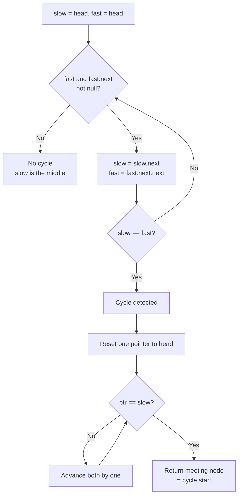

# Fast & Slow Pointers Pattern

Use two pointers moving at different speeds — Floyd's tortoise and hare — when you must detect a cycle, find a midpoint, or locate a repeated state in `O(n)` time and `O(1)` space.

## When To Pick This Pattern

Reach for fast & slow pointers when you notice:

- a **linked list** and a question about a **cycle** (does one exist? where does it start?)
- you need the **middle** of a list in one pass without knowing its length
- a sequence defined by "next = f(current)" that may **loop** (`Happy Number`)
- you want cycle detection **without extra space** (the hash-set alternative costs `O(n)`)
- finding the **n-th node from the end** with a fixed-gap pair

Ask yourself:

> "Can a hare moving twice as fast as the tortoise expose structure the tortoise alone cannot see?"

### What Each Pointer Gives You

| Goal | Setup | Reading |
|---|---|---|
| cycle exists? | slow +1, fast +2 | they meet inside the cycle |
| cycle start | reset one to head after meeting, both +1 | meet at the entry node |
| middle node | slow +1, fast +2 | slow is at the middle when fast hits the end |
| n-th from end | fast leads by n, then both +1 | slow lands on the target |

### When NOT To Use It

- the structure is not a chain / functional graph (no single deterministic "next")
- you need every node in the cycle, not just its start — traverse and record instead
- random access by index is available and simpler (arrays with known length)
- you must preserve which nodes were visited for later — a [hash set](hash-map-set.md) of nodes is clearer

## Algorithm

Advance `slow` by one and `fast` by two each step; if they ever reference the same node the structure has a cycle, otherwise `fast` reaches the end and there is none. To find the cycle **start**, reset one pointer to the head and step both by one until they meet again.



Key insight: the distance from the head to the cycle start equals the distance from the meeting point to the cycle start, which is why the reset-and-walk step lands exactly on the entry.

## Code (C#)

```csharp
public class ListNode
{
    public int val;
    public ListNode next;
    public ListNode(int val = 0, ListNode next = null)
    {
        this.val = val;
        this.next = next;
    }
}
```

### Detect a cycle

```csharp
// True if the linked list contains a cycle.
// The hare gains one node on the tortoise each step, so inside a cycle
// it must eventually land on the same node.
// Time: O(n), Space: O(1).
public static bool HasCycle(ListNode head)
{
    ListNode slow = head, fast = head;

    while (fast != null && fast.next != null)
    {
        slow = slow.next;        // +1
        fast = fast.next.next;   // +2

        if (slow == fast) return true;
    }

    return false; // fast reached the end -> no cycle
}
```

### Find the cycle start

```csharp
// Returns the node where the cycle begins, or null if there is none.
// Phase 1: find a meeting point. Phase 2: reset and walk in lockstep.
// Time: O(n), Space: O(1).
public static ListNode DetectCycleStart(ListNode head)
{
    ListNode slow = head, fast = head;

    while (fast != null && fast.next != null)
    {
        slow = slow.next;
        fast = fast.next.next;

        if (slow == fast) // meeting point found
        {
            ListNode ptr = head;
            while (ptr != slow)
            {
                ptr = ptr.next;
                slow = slow.next;
            }
            return ptr; // == cycle entry
        }
    }

    return null;
}
```

### Middle of the list

```csharp
// Returns the middle node (the second middle when the count is even).
// When fast falls off the end, slow has covered exactly half.
// Time: O(n), Space: O(1).
public static ListNode MiddleNode(ListNode head)
{
    ListNode slow = head, fast = head;

    while (fast != null && fast.next != null)
    {
        slow = slow.next;
        fast = fast.next.next;
    }

    return slow;
}
```

### Happy Number — cycle detection on a number sequence

```csharp
// A number is "happy" if repeatedly summing the squares of its digits reaches 1.
// The sequence of sums is a functional graph; a non-happy number loops.
// Time: O(log n) per step over a bounded number of steps, Space: O(1).
public static bool IsHappy(int n)
{
    int slow = n, fast = n;

    do
    {
        slow = SquareDigitSum(slow);            // +1
        fast = SquareDigitSum(SquareDigitSum(fast)); // +2
    }
    while (slow != fast);

    return slow == 1; // met at 1 => happy; met elsewhere => trapped in a loop
}

private static int SquareDigitSum(int x)
{
    int sum = 0;
    while (x > 0)
    {
        int d = x % 10;
        sum += d * d;
        x /= 10;
    }
    return sum;
}
```

## Practice Tasks

Work these in rough order of difficulty:

1. **Middle of the Linked List** — return the middle node. (slow/fast, fast +2)
2. **Linked List Cycle** — does a cycle exist? (tortoise and hare)
3. **Happy Number** — does the digit-square sequence reach 1? (cycle on numbers)
4. **Remove Nth Node From End of List** — one-pass deletion. (fixed gap of n)
5. **Linked List Cycle II** — return the cycle's start node. (meet, then reset)
6. **Palindrome Linked List** — is the list a palindrome? (find middle, reverse half)
7. **Reorder List** — L0 -> Ln -> L1 -> Ln-1 ... (middle + reverse + merge)
8. **Find the Duplicate Number** — the one repeated value, array as a linked list. (Floyd on indices)
9. **Circular Array Loop** — detect a valid cycle with direction rules. (fast/slow with constraints)

## Related Patterns

- [Two Pointers](two-pointers.md) — the same-array cousin where both pointers usually move at the same speed.
- [Hash Map / Hash Set](hash-map-set.md) — the `O(n)`-space alternative for visited-node cycle detection.
- [Sliding Window](sliding-window.md) — another two-pointer technique, but over contiguous ranges.
