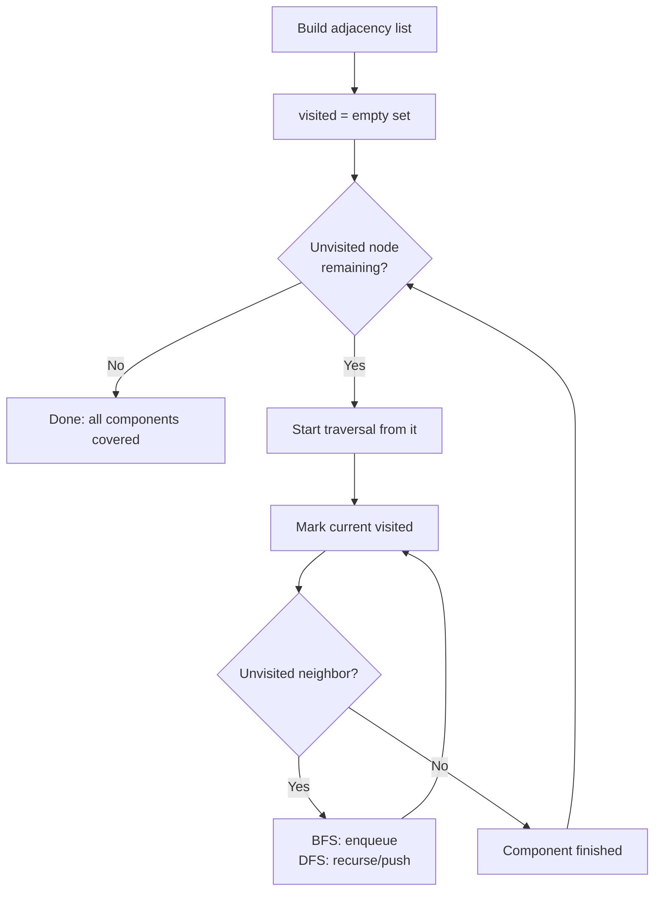

# Graph Traversal DFS & BFS Pattern

Use graph traversal when you must explore nodes connected by edges — visiting each once with a *visited set* to avoid looping — to find components, reachability, or shortest hops.

## When To Pick This Pattern

Reach for graph traversal when you notice:

- entities linked by edges (adjacency list, edge list, or a grid where cells are nodes)
- questions about reachability ("can A reach B?")
- counting connected components or islands
- shortest path measured in *number of edges* (unweighted → BFS)
- flood fill / region coloring on a grid
- cycle detection in an undirected or directed graph

Ask yourself:

> "Is my data a set of things connected by relationships, and could following those relationships revisit a node?"

### Choose DFS vs BFS

| You need | Traversal |
|---|---|
| just "visit everything reachable" / components | DFS or BFS (either works) |
| shortest path in edges (unweighted) | BFS (first time you reach a node is optimal) |
| deep recursion / backtracking / topological order | DFS |
| level-by-level spread (flood fill distance, rotting oranges) | BFS |
| weighted shortest path | neither — use Dijkstra (see below) |

### When NOT To Use It

- edges carry weights and you need the minimum-cost path — use **Dijkstra** (BFS with a min-heap) or Bellman-Ford
- you only need connectivity/merge queries with no path detail — [Union-Find](union-find.md) is simpler and near-`O(1)` per query
- the graph is a tree (no cycles) — the visited set is unnecessary; use [tree traversal](tree-traversal.md)

## Algorithm

Both DFS and BFS start from a source, mark it visited, and expand to unvisited neighbors — DFS via recursion/stack (go deep), BFS via a queue (go wide). To cover a disconnected graph, restart from every unvisited node.



Key discipline: **mark visited when you enqueue/push, not when you pop.** Marking on pop lets the same node get queued many times, blowing up memory and time.

## Code (C#)

### Adjacency list + DFS and BFS

```csharp
// Build an adjacency list from an edge list (undirected).
public static Dictionary<int, List<int>> BuildGraph(int n, int[][] edges)
{
    var graph = new Dictionary<int, List<int>>();
    for (int i = 0; i < n; i++) graph[i] = new List<int>();

    foreach (var e in edges)
    {
        graph[e[0]].Add(e[1]);
        graph[e[1]].Add(e[0]); // drop this line for a directed graph
    }
    return graph;
}

// DFS from a source, marking every reachable node.
// Time:  O(V + E), Space: O(V) for visited + recursion stack.
public static void Dfs(int node, Dictionary<int, List<int>> graph, HashSet<int> visited)
{
    visited.Add(node);
    foreach (int next in graph[node])
    {
        if (!visited.Contains(next))
        {
            Dfs(next, graph, visited);
        }
    }
}

// BFS from a source.
// Time: O(V + E), Space: O(V).
public static void Bfs(int start, Dictionary<int, List<int>> graph, HashSet<int> visited)
{
    var queue = new Queue<int>();
    queue.Enqueue(start);
    visited.Add(start);                 // mark on enqueue

    while (queue.Count > 0)
    {
        int node = queue.Dequeue();
        foreach (int next in graph[node])
        {
            if (visited.Add(next))      // Add returns false if already present
            {
                queue.Enqueue(next);
            }
        }
    }
}
```

### Connected components — count DFS restarts

```csharp
// Number of connected components in an undirected graph.
// Time: O(V + E), Space: O(V).
public static int CountComponents(int n, int[][] edges)
{
    var graph = BuildGraph(n, edges);
    var visited = new HashSet<int>();
    int components = 0;

    for (int i = 0; i < n; i++)
    {
        if (!visited.Contains(i))
        {
            Dfs(i, graph, visited); // one full traversal = one component
            components++;
        }
    }
    return components;
}
```

### Number of Islands — DFS flood fill on a grid

```csharp
// Grid cells are implicit nodes; 4-directional neighbors are edges.
// Time: O(rows * cols), Space: O(rows * cols) worst-case recursion.
public static int NumIslands(char[][] grid)
{
    if (grid == null || grid.Length == 0) return 0;
    int rows = grid.Length, cols = grid[0].Length;
    int islands = 0;

    for (int r = 0; r < rows; r++)
        for (int c = 0; c < cols; c++)
            if (grid[r][c] == '1')
            {
                islands++;
                Sink(grid, r, c); // flood the whole island so it's counted once
            }

    return islands;
}

private static void Sink(char[][] grid, int r, int c)
{
    // Out of bounds or water -> stop.
    if (r < 0 || c < 0 || r >= grid.Length || c >= grid[0].Length || grid[r][c] != '1')
        return;

    grid[r][c] = '0';        // mark visited in place
    Sink(grid, r + 1, c);
    Sink(grid, r - 1, c);
    Sink(grid, r, c + 1);
    Sink(grid, r, c - 1);
}
```

### BFS shortest path — fewest edges in an unweighted graph

```csharp
// Returns the minimum number of edges from start to target, or -1.
// The first time BFS reaches a node it does so via a shortest path.
// Time: O(V + E), Space: O(V).
public static int ShortestPath(int start, int target, Dictionary<int, List<int>> graph)
{
    if (start == target) return 0;

    var queue = new Queue<int>();
    var visited = new HashSet<int> { start };
    queue.Enqueue(start);
    int distance = 0;

    while (queue.Count > 0)
    {
        int levelSize = queue.Count; // process one "ring" at a time
        distance++;

        for (int i = 0; i < levelSize; i++)
        {
            int node = queue.Dequeue();
            foreach (int next in graph[node])
            {
                if (next == target) return distance;
                if (visited.Add(next)) queue.Enqueue(next);
            }
        }
    }

    return -1; // target unreachable
}
```

### Weighted variant — Dijkstra (brief)

When edges have non-negative weights, plain BFS no longer gives the cheapest path. Replace the FIFO queue with a **min-heap** keyed by cumulative cost: always expand the cheapest-so-far node, and relax its neighbors. That is Dijkstra's algorithm, running in `O(E log V)`. See [Heap / Priority Queue](heap-priority-queue.md) for the priority-queue mechanics.

## Practice Tasks

Work these in rough order of difficulty:

1. **Find if Path Exists in Graph** — reachability between two nodes. (DFS or BFS)
2. **Number of Islands** — count 1-regions in a grid. (DFS/BFS flood fill)
3. **Number of Connected Components in an Undirected Graph** — count DFS restarts. (component counting)
4. **Flood Fill** — recolor a connected region. (grid DFS/BFS)
5. **Rotting Oranges** — minutes until all oranges rot. (multi-source BFS by level)
6. **Clone Graph** — deep copy with cycles. (DFS/BFS + old→new map)
7. **Course Schedule** — cycle detection in a directed graph. (see [topological sort](topological-sort.md))
8. **Word Ladder** — shortest transformation sequence. (BFS over implicit word graph)
9. **Network Delay Time** — time for a signal to reach all nodes. (Dijkstra with a min-heap)

## Related Patterns

- [Tree Traversal](tree-traversal.md) — the acyclic special case, no visited set needed.
- [Topological Sort](topological-sort.md) — ordering nodes of a directed acyclic graph via DFS/BFS.
- [Union-Find](union-find.md) — connectivity and component queries without full traversal.
- [Heap / Priority Queue](heap-priority-queue.md) — powers Dijkstra for weighted shortest paths.
