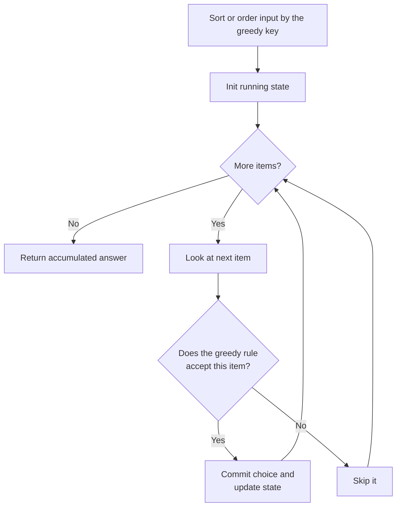

# Greedy Pattern

Use a greedy algorithm when making the **locally optimal choice at each step** provably leads to a globally optimal answer — no backtracking, no table.

## When To Pick This Pattern

Reach for greedy when you notice:

- at each step there is an obvious "best right now" choice (largest, smallest, earliest-finishing)
- once a choice is made you never need to reconsider it
- sorting the input first exposes a clean ordering to walk through
- interval, scheduling, or "reach the end" style problems
- the problem asks for a min/max and a simple rule seems to work

Ask yourself:

> "If I always grab the best-looking option now, can I prove no future choice would have done better?"

That proof usually takes one of two shapes:

- **Exchange argument** — take any optimal solution and show you can swap in the greedy choice without making it worse, so greedy is at least as good.
- **Greedy-stays-ahead** — show that after each step the greedy partial solution is at least as good as any other on the relevant metric.

### Greedy vs Dynamic Programming

| Situation | Approach |
|---|---|
| local best choice provably optimal | greedy |
| a choice's value depends on future subproblems that overlap | [dynamic programming](dynamic-programming.md) |
| unsure whether greedy is correct | prototype greedy, then verify against brute force / DP |

If you cannot construct an exchange or stays-ahead argument, assume greedy is **unsafe** and fall back to [DP](dynamic-programming.md). Classic trap: Coin Change with arbitrary denominations — greedy "largest coin first" fails, DP is required.

### When NOT To Use It

- a locally optimal pick can force a worse global outcome (no valid exchange argument)
- the problem needs all solutions or a count — use [backtracking](backtracking.md) or [DP](dynamic-programming.md)
- choices interact so that early decisions must sometimes be undone
- denominations/weights are irregular (Coin Change, 0/1 Knapsack) — DP territory

## Algorithm

Usually: establish an ordering (often by sorting), then sweep once, committing to each best choice and updating a small amount of state.



## Code (C#)

### Jump Game — track the furthest reachable index

```csharp
// True if you can reach the last index; nums[i] is the max jump from i.
// Greedy: keep the furthest reach; if a position is beyond it, we're stuck.
// Time: O(n), Space: O(1).
public static bool CanJump(int[] nums)
{
    int furthest = 0;

    for (int i = 0; i < nums.Length; i++)
    {
        // If i is unreachable, no later index can be reached either.
        if (i > furthest) return false;

        // Greedy choice: extend reach as far as this index allows.
        furthest = Math.Max(furthest, i + nums[i]);
    }

    return true;
}
```

### Assign Cookies — match smallest cookie to least greedy child

```csharp
// Maximize satisfied children; g[i] = greed, s[j] = cookie size.
// Greedy: give the smallest adequate cookie to the least greedy child.
// Time: O(n log n) for the sorts, Space: O(1).
public static int FindContentChildren(int[] g, int[] s)
{
    Array.Sort(g);
    Array.Sort(s);

    int child = 0, cookie = 0;
    while (child < g.Length && cookie < s.Length)
    {
        // If this cookie satisfies the current child, pair them off.
        if (s[cookie] >= g[child]) child++;
        cookie++; // cookie is used up (or too small) either way
    }

    return child;
}
```

### Interval Scheduling — keep the earliest-finishing intervals

```csharp
// Max number of non-overlapping intervals kept (remove the fewest).
// Greedy: always keep the interval that finishes earliest.
// Time: O(n log n), Space: O(1).
public static int MaxNonOverlapping(int[][] intervals)
{
    if (intervals.Length == 0) return 0;

    // Sort by end time: earliest finish leaves the most room after it.
    Array.Sort(intervals, (a, b) => a[1].CompareTo(b[1]));

    int count = 0;
    int lastEnd = int.MinValue;

    foreach (var interval in intervals)
    {
        // Keep it only if it starts at/after the last kept interval ended.
        if (interval[0] >= lastEnd)
        {
            count++;
            lastEnd = interval[1];
        }
    }

    return count;
}
```

## Practice Tasks

Work these in rough order of difficulty:

1. **Assign Cookies** — maximize satisfied children. (sort both, two pointers)
2. **Best Time to Buy and Sell Stock II** — sum every upward step. (grab all positive deltas)
3. **Jump Game** — can you reach the end? (track furthest reach)
4. **Non-overlapping Intervals** — remove fewest to de-overlap. (sort by end time)
5. **Gas Station** — find the start index to complete the loop. (if total gas >= cost, the unique start is just after the lowest running tank)
6. **Jump Game II** — minimum jumps to the end. (greedy BFS by reachable ranges)
7. **Task Scheduler** — minimum intervals with cooldown. (fill from the most frequent task)
8. **Partition Labels** — cut the string into max parts. (extend the part to each char's last index)
9. **Merge Intervals** — coalesce overlaps. (sort by start, extend the current merge)

## Related Patterns

- [Dynamic Programming](dynamic-programming.md) — the correct fallback when a greedy choice cannot be proven optimal.
- [Backtracking](backtracking.md) — when you must actually search choices instead of committing to one.
- [Two Pointers](two-pointers.md) — many greedy sweeps over sorted data are two-pointer walks.
