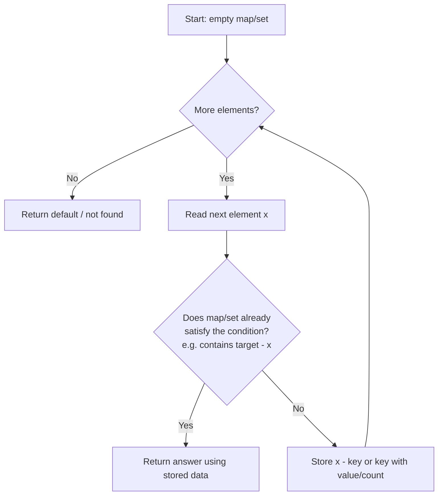

# Hash Map / Hash Set Pattern

Use hashing when the problem repeatedly asks *"have I seen this value / key before?"* and you want that lookup in `O(1)` average time instead of scanning.

## When To Pick This Pattern

Reach for a hash map or hash set when you notice:

- lookup by value rather than by position
- duplicate detection (`Contains Duplicate`)
- complements like `target - x` (`Two Sum`)
- frequency counting (`Top K Frequent`, anagrams)
- grouping items by a computed key
- de-duplication or membership tests inside another loop

Ask yourself:

> "Am I repeatedly searching for something I could remember in `O(1)` average time?"

### Choose Map vs Set

| You need | Structure |
|---|---|
| just membership ("did I see it?") | `HashSet<T>` |
| a value associated with a key (index, count) | `Dictionary<K,V>` |
| ordered keys / range queries | not a hash — use `SortedDictionary` or binary search |

### When NOT To Use It

- input is sorted and you can use two pointers with `O(1)` space
- you need ordered traversal or range queries (hash loses order)
- keys are a small bounded range — a plain array is faster and simpler
- memory is tight — hashing costs `O(n)` extra space

## Algorithm

The core idea: make one pass, and for each element decide the answer using what you have already stored, *then* store the current element.



Key discipline: **check before you insert**. Inserting first can let an element match itself (e.g. Two Sum with a single element equal to half the target).

## Code (C#)

### Two Sum — map from value to index

```csharp
// Returns indices of the two numbers that add up to target.
// Time:  O(n) - single pass.
// Space: O(n) - stores up to n entries.
public static int[] TwoSum(int[] nums, int target)
{
    // Maps a previously seen value -> the index it appeared at.
    var seen = new Dictionary<int, int>();

    for (int i = 0; i < nums.Length; i++)
    {
        int complement = target - nums[i];

        // Check BEFORE inserting so nums[i] can't pair with itself.
        if (seen.TryGetValue(complement, out int index))
        {
            return new[] { index, i };
        }

        // Remember this value for future complements.
        seen[nums[i]] = i;
    }

    return Array.Empty<int>();
}
```

### Contains Duplicate — set for membership

```csharp
// True if any value appears at least twice.
// Time: O(n), Space: O(n).
public static bool ContainsDuplicate(int[] nums)
{
    var seen = new HashSet<int>();

    foreach (int x in nums)
    {
        // HashSet.Add returns false if the item was already present.
        if (!seen.Add(x))
        {
            return true;
        }
    }

    return false;
}
```

### Frequency counting — the counting idiom

```csharp
// Groups words that are anagrams of each other.
// Key = sorted characters; value = the group.
// Time: O(n * k log k) for n words of length up to k.
public static IList<IList<string>> GroupAnagrams(string[] words)
{
    var groups = new Dictionary<string, IList<string>>();

    foreach (string word in words)
    {
        // Build a canonical key so anagrams collapse together.
        char[] chars = word.ToCharArray();
        Array.Sort(chars);
        string key = new string(chars);

        // Idiom: create the bucket on first sight, then append.
        if (!groups.TryGetValue(key, out var bucket))
        {
            bucket = new List<string>();
            groups[key] = bucket;
        }

        bucket.Add(word);
    }

    return groups.Values.ToList();
}
```

## Practice Tasks

Work these in rough order of difficulty:

1. **Contains Duplicate** — return true if any value repeats. (set)
2. **Two Sum** — indices summing to target. (map value→index)
3. **Valid Anagram** — are two strings anagrams? (frequency count)
4. **Intersection of Two Arrays** — unique common elements. (set intersection)
5. **First Unique Character in a String** — first non-repeating char. (count then scan)
6. **Group Anagrams** — bucket by sorted-char key. (map key→list)
7. **Subarray Sum Equals K** — count subarrays summing to k. (map of prefix-sum counts — combine with [prefix-sum](prefix-sum.md))
8. **Longest Consecutive Sequence** — longest run in `O(n)`. (set membership, start only from run beginnings)
9. **LRU Cache** — `O(1)` get/put. (dictionary + doubly linked list)

## Related Patterns

- [Prefix Sum](prefix-sum.md) — often pairs with a hash map of seen sums.
- [Two Pointers](two-pointers.md) — the sorted-input alternative that avoids extra space.
- [Sliding Window](sliding-window.md) — window contents are frequently tracked in a map.
