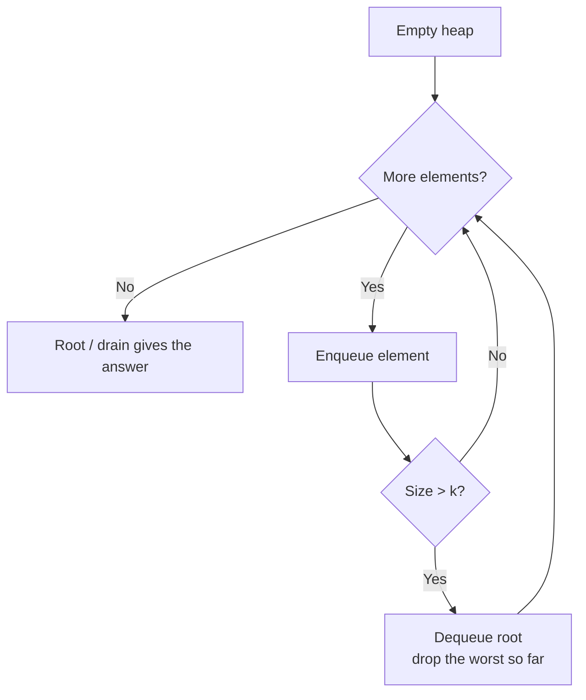

# Heap / Priority Queue Pattern

Use a heap when you repeatedly need the **smallest or largest** element of a changing set in `O(log n)`, without keeping everything fully sorted.

## When To Pick This Pattern

Reach for a priority queue when you notice:

- "kth largest / kth smallest" — track only the k that matter
- "top k frequent / closest / cheapest" — a bounded heap of size k
- merging several sorted sequences (`Merge K Sorted Lists`)
- a running **median** or split-set problem (two heaps)
- scheduling: always process the earliest-finishing / highest-priority task next
- streaming data where you can't sort the whole thing up front

Ask yourself:

> "Do I keep asking for the current min or max as items come and go? A heap gives me that in `O(log n)` instead of re-sorting."

| Goal | Heap choice |
|---|---|
| kth **largest** | **min**-heap of size k (evict the smallest) |
| kth **smallest** | **max**-heap of size k |
| top k frequent | min-heap keyed by frequency, size k |
| running median | max-heap (low half) + min-heap (high half) |

In C#, `PriorityQueue<TElement, TPriority>` is a **min**-heap by priority. For a max-heap, negate the priority or pass a reversed comparer.

### When NOT To Use It

- you need the full sorted order anyway — just sort once, `O(n log n)`
- you need k close to n — sorting is simpler and comparable in cost
- you need arbitrary lookup or removal by key — a heap only exposes the extreme
- the range of keys is small and bounded — counting sort / buckets beat a heap

## Algorithm

Feed elements in; keep the heap's size bounded (for "top k") and let the root be the answer or the eviction candidate.



Key discipline: for kth-largest keep a **min**-heap of size k — after processing everything, the root is the kth largest because the k-1 larger values sit above it.

## Code (C#)

### Kth Largest Element — bounded min-heap

```csharp
// Returns the kth largest value in nums.
// Keep only k elements; the smallest of them (the root) is the kth largest.
// Time:  O(n log k).
// Space: O(k).
public static int FindKthLargest(int[] nums, int k)
{
    // Min-heap: PriorityQueue dequeues the lowest priority first.
    var heap = new PriorityQueue<int, int>();

    foreach (int x in nums)
    {
        heap.Enqueue(x, x);      // element and its priority are the same value.

        if (heap.Count > k)
        {
            heap.Dequeue();      // drop the current smallest; too small to be top-k.
        }
    }

    return heap.Peek();          // root = kth largest.
}
```

### Top K Frequent Elements — heap keyed by frequency

```csharp
// Returns the k most frequent values.
// Count first, then keep a min-heap of size k keyed by frequency.
// Time:  O(n log k), Space: O(n).
public static int[] TopKFrequent(int[] nums, int k)
{
    var counts = new Dictionary<int, int>();
    foreach (int x in nums)
    {
        counts[x] = counts.GetValueOrDefault(x) + 1;
    }

    // Priority = frequency; smallest frequency sits at the root for eviction.
    var heap = new PriorityQueue<int, int>();
    foreach (var (value, freq) in counts)
    {
        heap.Enqueue(value, freq);
        if (heap.Count > k)
        {
            heap.Dequeue();      // evict the least frequent seen so far.
        }
    }

    // Drain what remains: exactly the k most frequent.
    var result = new int[k];
    for (int i = 0; i < k; i++)
    {
        result[i] = heap.Dequeue();
    }
    return result;
}
```

### Merge K Sorted Lists — heap of list heads

```csharp
public class ListNode { public int val; public ListNode next; public ListNode(int v = 0, ListNode n = null) { val = v; next = n; } }

// Merges k ascending linked lists into one.
// Heap holds the current head of each list; pop the min, push its successor.
// Time:  O(N log k) for N total nodes across k lists.
// Space: O(k) for the heap.
public static ListNode MergeKLists(ListNode[] lists)
{
    var heap = new PriorityQueue<ListNode, int>();

    foreach (var head in lists)
    {
        if (head != null) heap.Enqueue(head, head.val);
    }

    var dummy = new ListNode();
    var tail = dummy;

    while (heap.Count > 0)
    {
        var node = heap.Dequeue();      // smallest available head.
        tail.next = node;
        tail = node;

        if (node.next != null)
        {
            heap.Enqueue(node.next, node.next.val); // advance that list.
        }
    }

    return dummy.next;
}
```

### Find Median from Data Stream — two heaps

```csharp
// Maintains a running median as numbers arrive.
// low  = max-heap of the smaller half (root = biggest of the low half).
// high = min-heap of the larger half (root = smallest of the high half).
// Add/rebalance: O(log n). Median: O(1).
public class MedianFinder
{
    // Max-heap via negated priority; larger values get lower (more urgent) priority.
    private readonly PriorityQueue<int, int> _low = new(Comparer<int>.Create((a, b) => b - a));
    private readonly PriorityQueue<int, int> _high = new();

    public void AddNum(int num)
    {
        // Route into the low half, then push its max over to the high half.
        _low.Enqueue(num, num);
        int lowMax = _low.Dequeue();
        _high.Enqueue(lowMax, lowMax);

        // Keep low >= high in size (low holds the extra element when odd count).
        if (_high.Count > _low.Count)
        {
            int highMin = _high.Dequeue();
            _low.Enqueue(highMin, highMin);
        }
    }

    public double FindMedian()
    {
        // Equal sizes -> average the two roots; otherwise low has the middle element.
        if (_low.Count == _high.Count)
        {
            return (_low.Peek() + _high.Peek()) / 2.0;
        }
        return _low.Peek();
    }
}
```

## Practice Tasks

Work these in rough order of difficulty:

1. **Kth Largest Element in a Stream** — kth largest as values arrive. (min-heap of size k)
2. **Last Stone Weight** — smash the two heaviest repeatedly. (max-heap)
3. **Kth Largest Element in an Array** — one-shot selection. (bounded min-heap)
4. **K Closest Points to Origin** — nearest k points. (max-heap of size k by distance)
5. **Top K Frequent Elements** — most common values. (count + min-heap)
6. **Task Scheduler** — min intervals with cooldown. (max-heap by remaining count)
7. **Merge K Sorted Lists** — merge sorted lists. (heap of heads)
8. **Find Median from Data Stream** — running median. (two heaps)
9. **Find K Pairs with Smallest Sums** — smallest-sum pairs. (heap over frontier pairs)

## Related Patterns

- [Binary Search](binary-search.md) — another route to "kth" and selection problems.
- [Sorting](sorting.md) — when k approaches n, just sort.
- [Hash Map / Hash Set](hash-map-set.md) — pairs with the heap for frequency-based top-k.
