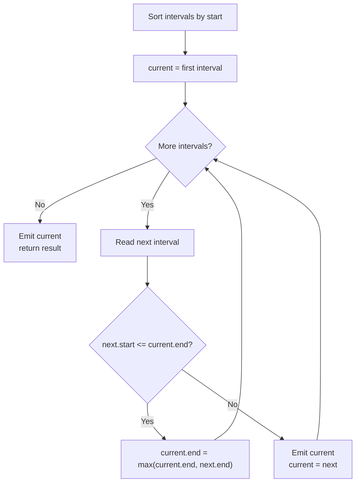

# Intervals Pattern

Use this pattern when the input is a set of `[start, end]` ranges and the question is about **overlap, merging, or fitting them together** — sorting by start (or by end) makes the structure obvious.

## When To Pick This Pattern

Reach for the intervals pattern when you notice:

- inputs shaped like `[start, end]` — time ranges, segments, bookings
- "merge overlapping" / "insert a new interval"
- "how many can I keep without overlap?" / "how many to remove?"
- "how many rooms / resources are needed at the busiest moment?"
- anything about meetings, schedules, or calendar conflicts

Ask yourself:

> "If I lay these ranges on a number line and sweep left to right, does the answer fall out from how they overlap?"

| Question | Sort by | Core tool |
|---|---|---|
| merge / insert overlapping | start | compare end vs next start |
| max non-overlapping / min removals | **end** | greedy, keep earliest-ending |
| min rooms / max concurrency | start | min-heap of end times |

### When NOT To Use It

- the ranges never interact — treat each independently
- data isn't range-shaped and can't be modeled as `[start, end]`
- you need per-point queries over a fixed set — a prefix sum / difference array or segment tree may fit better
- ordering by start is meaningless (e.g. circular ranges) without extra handling

## Algorithm

Sort first — almost always by start. Then sweep once, comparing each interval to the running "current" interval (for merging) or to a heap of active end times (for concurrency).



Key discipline: decide up front whether you sort by **start** (merging, room counting) or by **end** (greedy selection). Getting that wrong is the classic mistake.

## Code (C#)

### Merge Intervals — sort by start, extend the current

```csharp
// Merges all overlapping intervals.
// Time:  O(n log n) - dominated by the sort.
// Space: O(n) - the output list.
public static int[][] Merge(int[][] intervals)
{
    if (intervals.Length == 0) return intervals;

    // Sort by start so overlaps are always adjacent.
    Array.Sort(intervals, (a, b) => a[0].CompareTo(b[0]));

    var merged = new List<int[]>();
    var current = intervals[0];

    foreach (var next in intervals.Skip(1))
    {
        if (next[0] <= current[1])       // overlap: next starts before current ends.
        {
            current[1] = Math.Max(current[1], next[1]); // extend the right edge.
        }
        else
        {
            merged.Add(current);         // no overlap: current is finalized.
            current = next;
        }
    }

    merged.Add(current);                 // don't forget the last one.
    return merged.ToArray();
}
```

### Insert Interval — into an already-sorted list

```csharp
// Inserts newInterval into a sorted, non-overlapping list and re-merges.
// Time:  O(n), Space: O(n).
public static int[][] Insert(int[][] intervals, int[] newInterval)
{
    var result = new List<int[]>();
    int i = 0, n = intervals.Length;

    // 1. Intervals entirely before newInterval: copy as-is.
    while (i < n && intervals[i][1] < newInterval[0])
    {
        result.Add(intervals[i++]);
    }

    // 2. Overlapping intervals: absorb them into newInterval.
    while (i < n && intervals[i][0] <= newInterval[1])
    {
        newInterval[0] = Math.Min(newInterval[0], intervals[i][0]);
        newInterval[1] = Math.Max(newInterval[1], intervals[i][1]);
        i++;
    }
    result.Add(newInterval);

    // 3. Intervals entirely after: copy the rest.
    while (i < n)
    {
        result.Add(intervals[i++]);
    }

    return result.ToArray();
}
```

### Non-overlapping Intervals — greedy by end time

```csharp
// Minimum number of intervals to remove so the rest don't overlap.
// Greedy: always keep the interval that ends earliest -> leaves the most room.
// Time:  O(n log n), Space: O(1).
public static int EraseOverlapIntervals(int[][] intervals)
{
    if (intervals.Length == 0) return 0;

    // Sort by END, not start — that's what makes the greedy choice optimal.
    Array.Sort(intervals, (a, b) => a[1].CompareTo(b[1]));

    int removed = 0;
    int prevEnd = intervals[0][1];

    foreach (var interval in intervals.Skip(1))
    {
        if (interval[0] < prevEnd)       // overlaps the last kept interval.
        {
            removed++;                   // remove this one (it ends later).
        }
        else
        {
            prevEnd = interval[1];       // no overlap: keep it, advance the frontier.
        }
    }

    return removed;
}
```

### Meeting Rooms II — min-heap of end times

```csharp
// Minimum number of rooms needed to host all meetings.
// Sort by start; a min-heap holds the end times of meetings still in progress.
// The heap's size at its peak is the answer.
// Time:  O(n log n), Space: O(n).
public static int MinMeetingRooms(int[][] intervals)
{
    if (intervals.Length == 0) return 0;

    Array.Sort(intervals, (a, b) => a[0].CompareTo(b[0]));

    // Min-heap keyed by end time: the soonest-freeing room is at the root.
    var endTimes = new PriorityQueue<int, int>();

    foreach (var meeting in intervals)
    {
        // If the earliest-ending meeting is done before this one starts,
        // reuse that room by popping it.
        if (endTimes.Count > 0 && endTimes.Peek() <= meeting[0])
        {
            endTimes.Dequeue();
        }

        endTimes.Enqueue(meeting[1], meeting[1]); // occupy a room until this end.
    }

    return endTimes.Count; // rooms in use once everything is scheduled.
}
```

## Practice Tasks

Work these in rough order of difficulty:

1. **Meeting Rooms** — can one person attend all meetings? (sort, check any overlap)
2. **Merge Intervals** — combine overlapping ranges. (sort by start, extend)
3. **Insert Interval** — add one interval and re-merge. (three-phase sweep)
4. **Interval List Intersections** — pairwise overlaps of two lists. (two pointers over sorted lists)
5. **Non-overlapping Intervals** — min removals to remove overlaps. (greedy by end)
6. **Minimum Number of Arrows to Burst Balloons** — min points hitting all ranges. (greedy by end)
7. **Meeting Rooms II** — min concurrent rooms. (min-heap of end times)
8. **Car Pooling** — capacity never exceeded. (difference array over start/end)
9. **Employee Free Time** — gaps common to all schedules. (merge all, find gaps)

## Related Patterns

- [Sorting](sorting.md) — every interval solution starts with the right sort key.
- [Heap / Priority Queue](heap-priority-queue.md) — tracks active end times for room/concurrency problems.
- [Two Pointers](two-pointers.md) — walks two sorted interval lists for intersections.
