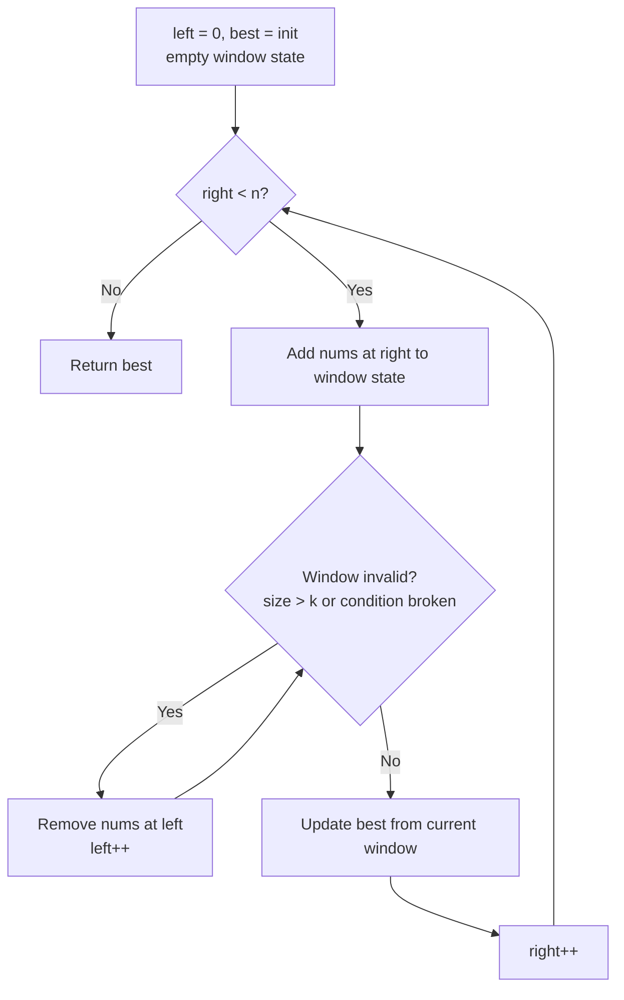

# Sliding Window Pattern

Use a sliding window when the answer is about a **contiguous** subarray or substring and you can update the answer incrementally as the window grows and shrinks, turning an `O(n^2)` scan into `O(n)`.

## When To Pick This Pattern

Reach for a sliding window when you notice:

- the problem asks for a **contiguous** subarray / substring (not a subsequence)
- keywords like **longest**, **shortest**, **maximum sum**, or **contains** over a run
- a **fixed length k** ("every subarray of size k") — a fixed window
- a **condition** to satisfy while maximising or minimising length — a variable window
- you can maintain a running aggregate (sum, count, frequency map) cheaply as the window moves

Ask yourself:

> "As I extend the window by one element on the right, can I cheaply fix any violation by shrinking from the left?"

### Fixed vs Variable Window

| Window | Right pointer | Left pointer | Example |
|---|---|---|---|
| fixed size k | advances every step | follows k behind | max sum of size k |
| variable | expands to include more | shrinks while a condition is violated | longest substring without repeats, min window |

### When NOT To Use It

- the subarray need not be contiguous (subsequence problems — try DP)
- shrinking the window cannot repair a violation (aggregate is not monotonic under removal)
- you need the k largest values regardless of position — use a heap
- the input is sorted and you compare ends — [Two Pointers](two-pointers.md) fits better

## Algorithm

Expand the window by moving `right` one step at a time; whenever the window breaks its invariant, advance `left` to restore it, and record the answer at each valid state.



Key discipline: **`left` only ever moves forward**. Because each pointer advances at most `n` times, the whole scan is `O(n)` even with the inner shrink loop.

## Code (C#)

### Max sum of a fixed-size window

```csharp
// Maximum sum of any contiguous subarray of length k.
// Slide by adding the entering element and subtracting the leaving one.
// Time:  O(n) - each element enters and leaves once.
// Space: O(1).
public static int MaxSumSizeK(int[] nums, int k)
{
    int windowSum = 0;

    // Prime the first window.
    for (int i = 0; i < k; i++) windowSum += nums[i];

    int best = windowSum;

    for (int right = k; right < nums.Length; right++)
    {
        windowSum += nums[right] - nums[right - k]; // add new, drop old
        best = Math.Max(best, windowSum);
    }

    return best;
}
```

### Longest substring without repeating characters — variable window

```csharp
// Length of the longest substring with all-distinct characters.
// lastSeen maps a char -> its most recent index; jump left past any repeat.
// Time:  O(n) - each pointer advances at most n times.
// Space: O(min(n, alphabet)).
public static int LengthOfLongestSubstring(string s)
{
    var lastSeen = new Dictionary<char, int>();
    int left = 0, best = 0;

    for (int right = 0; right < s.Length; right++)
    {
        char c = s[right];

        // If c is already inside the window, shrink left past its last spot.
        if (lastSeen.TryGetValue(c, out int prev) && prev >= left)
        {
            left = prev + 1;
        }

        lastSeen[c] = right;
        best = Math.Max(best, right - left + 1);
    }

    return best;
}
```

### Longest subarray with sum <= limit — shrink to restore condition

```csharp
// Longest contiguous subarray whose sum does not exceed limit (non-negative nums).
// Grow right; while the sum is too big, shrink from left.
// Time: O(n), Space: O(1).
public static int LongestSubarrayAtMost(int[] nums, int limit)
{
    int left = 0, sum = 0, best = 0;

    for (int right = 0; right < nums.Length; right++)
    {
        sum += nums[right];

        // Restore the invariant: sum <= limit.
        while (sum > limit && left <= right)
        {
            sum -= nums[left];
            left++;
        }

        best = Math.Max(best, right - left + 1);
    }

    return best;
}
```

### Minimum window substring — shrink to minimise

```csharp
// Smallest substring of s containing every char of t (with multiplicity).
// Expand to become valid, then shrink greedily to find the tightest window.
// Time: O(n + m), Space: O(alphabet).
public static string MinWindow(string s, string t)
{
    if (string.IsNullOrEmpty(s) || string.IsNullOrEmpty(t)) return "";

    var need = new Dictionary<char, int>();
    foreach (char c in t) need[c] = need.GetValueOrDefault(c) + 1;

    int required = need.Count;   // distinct chars still to satisfy
    int formed = 0;              // distinct chars currently satisfied
    var window = new Dictionary<char, int>();

    int left = 0, bestLen = int.MaxValue, bestStart = 0;

    for (int right = 0; right < s.Length; right++)
    {
        char c = s[right];
        window[c] = window.GetValueOrDefault(c) + 1;

        if (need.ContainsKey(c) && window[c] == need[c]) formed++;

        // Once valid, shrink from the left while it stays valid.
        while (formed == required)
        {
            if (right - left + 1 < bestLen)
            {
                bestLen = right - left + 1;
                bestStart = left;
            }

            char lc = s[left];
            window[lc]--;
            if (need.ContainsKey(lc) && window[lc] < need[lc]) formed--;
            left++;
        }
    }

    return bestLen == int.MaxValue ? "" : s.Substring(bestStart, bestLen);
}
```

## Practice Tasks

Work these in rough order of difficulty:

1. **Maximum Average Subarray I** — best average over size k. (fixed window)
2. **Contains Duplicate II** — a repeat within distance k. (fixed window + set)
3. **Longest Substring Without Repeating Characters** — all-distinct run. (variable window + map)
4. **Max Consecutive Ones III** — longest run of 1s flipping at most k zeros. (variable window, count zeros)
5. **Fruit Into Baskets** — longest subarray with at most 2 distinct values. (variable window + map)
6. **Longest Repeating Character Replacement** — longest run after k replacements. (window + max freq)
7. **Permutation in String** — does a permutation of s1 appear in s2? (fixed window frequency match)
8. **Minimum Size Subarray Sum** — shortest subarray with sum >= target. (shrink to minimise)
9. **Minimum Window Substring** — smallest window covering t. (need/formed counters)

## Related Patterns

- [Two Pointers](two-pointers.md) — sliding window is a same-direction two-pointer with an invariant.
- [Hash Map / Hash Set](hash-map-set.md) — window contents are usually tracked in a frequency map.
- [Prefix Sum](prefix-sum.md) — the alternative when the window can contain negatives and shrinking breaks monotonicity.
