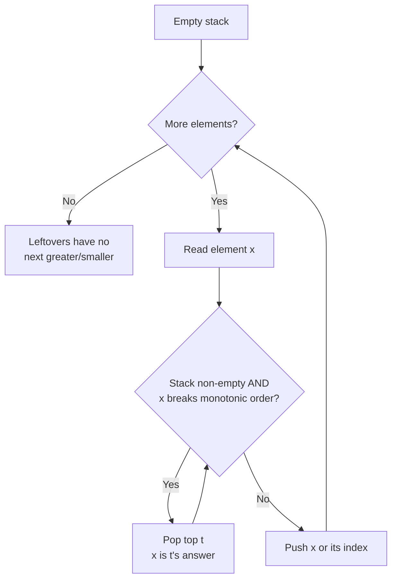

# Stack & Monotonic Stack Pattern

Use a stack when the **most recent** unresolved item is the one you need next (LIFO); use a **monotonic** stack when each element is waiting for the next larger or smaller value.

## When To Pick This Pattern

Reach for a plain stack when you notice:

- matching pairs that nest — brackets, tags, folder paths
- "undo the last thing" / backtracking on the most recent choice
- evaluating expressions or converting between notations

Reach for a **monotonic** stack when you notice:

- "next greater / next smaller element" for every position
- "how far until a bigger value?" (`Daily Temperatures`)
- spans and areas bounded by heights (`Largest Rectangle in Histogram`)
- you want an `O(n)` solution where the brute force is `O(n^2)` nested comparisons

Ask yourself:

> "For each element, do I care about the nearest earlier element that is bigger/smaller than it? Then keep the stack sorted in that direction."

### Which monotonic direction?

| You want | Keep the stack | Pop when incoming element is |
|---|---|---|
| next **greater** element | decreasing (top is smallest) | greater than the top |
| next **smaller** element | increasing (top is largest) | smaller than the top |
| previous greater / smaller | mirror the above, scan direction stays | same rule |

Rule of thumb: the value that causes a pop is the *answer* for the popped element.

### When NOT To Use It

- you need random access or search by value — use an array or hash map
- ordering does not matter and you only count things — a counter suffices
- the relationship is between distant, non-monotonic elements — a stack won't capture it
- you need FIFO (process oldest first) — that's a queue, not a stack

## Algorithm

Scan once. Push indices/values; before pushing, **pop everything that the current element resolves**, recording each popped item's answer.



Key discipline: push **indices**, not values, whenever the answer is a distance or you need the original position later.

## Code (C#)

### Valid Parentheses — plain matching stack

```csharp
// True if every bracket is closed by the correct type in the right order.
// Time:  O(n).
// Space: O(n) - worst case all opening brackets.
public static bool IsValid(string s)
{
    var stack = new Stack<char>();
    var pairs = new Dictionary<char, char> { [')'] = '(', [']'] = '[', ['}'] = '{' };

    foreach (char c in s)
    {
        if (pairs.ContainsValue(c))
        {
            stack.Push(c);                 // opening bracket: remember it.
        }
        else if (pairs.TryGetValue(c, out char open))
        {
            // Closing bracket must match the most recent opening bracket.
            if (stack.Count == 0 || stack.Pop() != open) return false;
        }
    }

    return stack.Count == 0;               // nothing left unmatched.
}
```

### Daily Temperatures — monotonic decreasing stack of indices

```csharp
// answer[i] = number of days until a warmer temperature, else 0.
// Stack holds indices whose warmer day is still unknown, temps decreasing.
// Time:  O(n) - each index is pushed and popped at most once.
// Space: O(n).
public static int[] DailyTemperatures(int[] temps)
{
    int n = temps.Length;
    var answer = new int[n];
    var stack = new Stack<int>(); // indices of unresolved days.

    for (int i = 0; i < n; i++)
    {
        // Today is warmer than the days waiting on top -> resolve them.
        while (stack.Count > 0 && temps[i] > temps[stack.Peek()])
        {
            int day = stack.Pop();
            answer[day] = i - day;      // distance to the warmer day.
        }

        stack.Push(i);                  // this day now waits for its warmer day.
    }

    return answer; // unresolved days keep their default 0.
}
```

### Largest Rectangle in Histogram — increasing stack, area on pop

```csharp
// Largest axis-aligned rectangle formed by contiguous bars.
// Keep indices of increasing heights; when a shorter bar arrives, the popped
// bar's rectangle can no longer extend right, so finalize its area.
// Time:  O(n), Space: O(n).
public static int LargestRectangleArea(int[] heights)
{
    var stack = new Stack<int>(); // indices of increasing heights.
    int best = 0;
    int n = heights.Length;

    // i == n uses a virtual height of 0 to flush the stack at the end.
    for (int i = 0; i <= n; i++)
    {
        int h = i < n ? heights[i] : 0;

        while (stack.Count > 0 && h < heights[stack.Peek()])
        {
            int height = heights[stack.Pop()];
            // Width spans from the element after the new top up to i - 1.
            int left = stack.Count == 0 ? -1 : stack.Peek();
            int width = i - left - 1;
            best = Math.Max(best, height * width);
        }

        stack.Push(i);
    }

    return best;
}
```

## Practice Tasks

Work these in rough order of difficulty:

1. **Valid Parentheses** — balanced bracket check. (matching stack)
2. **Baseball Game** — apply operations to a running record. (push/pop values)
3. **Remove All Adjacent Duplicates In String** — collapse neighboring pairs. (push unless it cancels the top)
4. **Next Greater Element I** — next bigger value per query. (monotonic decreasing + map)
5. **Daily Temperatures** — days until warmer. (monotonic stack of indices)
6. **Asteroid Collision** — simulate collisions. (stack, resolve on the top)
7. **Evaluate Reverse Polish Notation** — compute an RPN expression. (operand stack)
8. **Largest Rectangle in Histogram** — max area under bars. (increasing stack, area on pop)
9. **Trapping Rain Water** — water held between bars. (monotonic stack or two pointers)

## Related Patterns

- [Two Pointers](two-pointers.md) — an alternative for histogram/trapping-water problems.
- [Heap / Priority Queue](heap-priority-queue.md) — when you need the extreme element, not the most recent.
- [Sliding Window](sliding-window.md) — a monotonic deque generalizes this to windows.
