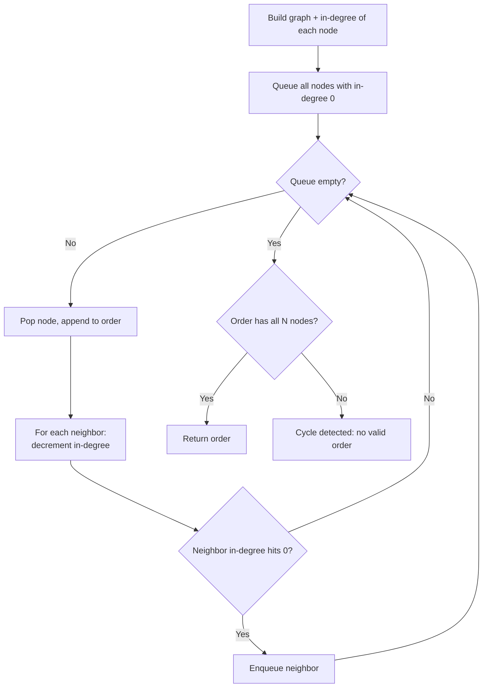

# Topological Sort Pattern

Use topological sort when tasks have *dependencies* and you need a linear order in which every task comes before the ones that depend on it — only possible when the dependency graph is a DAG (no cycles).

## When To Pick This Pattern

Reach for topological sort when you notice:

- "do X before Y" style prerequisites (course schedules, build steps)
- a directed graph and a question about a valid ordering
- detecting whether a set of dependencies is even satisfiable (cycle → impossible)
- ordering compilation units, package installs, or task pipelines
- resolving `a` depends on `b` depends on `c` chains

Ask yourself:

> "Do my items form a directed dependency graph, and do I need a legal order — or just to know if one exists?"

### Choose Kahn (BFS) vs DFS coloring

| You prefer | Approach |
|---|---|
| iterative, easy cycle check, natural "ready queue" | Kahn's algorithm (BFS on in-degrees) |
| recursive, reuse existing DFS, reverse-postorder | DFS with 3-color marking |
| lexicographically smallest order | Kahn's with a min-heap ready queue |
| detect a cycle while ordering | either — Kahn: leftover nodes; DFS: gray node revisited |

### When NOT To Use It

- the graph is undirected — "before/after" is undefined; use [graph traversal](graph-traversal.md) or [union-find](union-find.md)
- the graph has cycles and you actually need to keep them — topo order does not exist
- there are no dependencies at all — any order works, no sort needed

## Algorithm

**Kahn's (BFS):** repeatedly remove a node with in-degree 0 (nothing left blocking it), append it to the order, and decrement its neighbors' in-degrees. **DFS coloring:** finish a node only after all its descendants finish; the reverse finish order is a valid topo order, and revisiting a "gray" (in-progress) node signals a cycle.



Key discipline: after Kahn's loop, **compare the produced count to the node count.** A shortfall means some nodes never reached in-degree 0 — they sit on a cycle.

## Code (C#)

### Kahn's algorithm — BFS with in-degrees

```csharp
// Returns a valid topological order, or an empty array if a cycle exists.
// numNodes labeled 0..numNodes-1; edges[i] = [from, to] meaning from -> to.
// Time:  O(V + E), Space: O(V + E).
public static int[] TopoSortKahn(int numNodes, int[][] edges)
{
    var adj = new List<int>[numNodes];
    var inDegree = new int[numNodes];
    for (int i = 0; i < numNodes; i++) adj[i] = new List<int>();

    foreach (var e in edges)
    {
        adj[e[0]].Add(e[1]);
        inDegree[e[1]]++;          // e[1] gains a prerequisite
    }

    // Start with everything that has no prerequisites.
    var ready = new Queue<int>();
    for (int i = 0; i < numNodes; i++)
        if (inDegree[i] == 0) ready.Enqueue(i);

    var order = new List<int>();
    while (ready.Count > 0)
    {
        int node = ready.Dequeue();
        order.Add(node);

        foreach (int next in adj[node])
            if (--inDegree[next] == 0)  // last prerequisite cleared
                ready.Enqueue(next);
    }

    // Fewer than numNodes placed => a cycle blocked the rest.
    return order.Count == numNodes ? order.ToArray() : Array.Empty<int>();
}
```

### DFS coloring — 3-state cycle detection + order

```csharp
// 0 = white (unseen), 1 = gray (in progress), 2 = black (finished).
// Time: O(V + E), Space: O(V + E).
public static int[] TopoSortDfs(int numNodes, int[][] edges)
{
    var adj = new List<int>[numNodes];
    for (int i = 0; i < numNodes; i++) adj[i] = new List<int>();
    foreach (var e in edges) adj[e[0]].Add(e[1]);

    var color = new int[numNodes];
    var order = new List<int>();
    bool hasCycle = false;

    void Dfs(int node)
    {
        color[node] = 1;                 // mark gray: on the current path
        foreach (int next in adj[node])
        {
            if (color[next] == 1) { hasCycle = true; return; } // back edge -> cycle
            if (color[next] == 0) Dfs(next);
        }
        color[node] = 2;                 // mark black: fully explored
        order.Add(node);                 // finish order (will be reversed)
    }

    for (int i = 0; i < numNodes && !hasCycle; i++)
        if (color[i] == 0) Dfs(i);

    if (hasCycle) return Array.Empty<int>();

    order.Reverse();                     // reverse finish order = topo order
    return order.ToArray();
}
```

### Course Schedule — can all courses be finished?

```csharp
// True iff the prerequisite graph is a DAG (no cycle).
// prerequisites[i] = [course, prereq] meaning prereq -> course.
// Time: O(V + E), Space: O(V + E).
public static bool CanFinish(int numCourses, int[][] prerequisites)
{
    // Reuse Kahn: a full ordering exists exactly when there is no cycle.
    var edges = new int[prerequisites.Length][];
    for (int i = 0; i < prerequisites.Length; i++)
        edges[i] = new[] { prerequisites[i][1], prerequisites[i][0] };

    return TopoSortKahn(numCourses, edges).Length == numCourses;
}
```

## Practice Tasks

Work these in rough order of difficulty:

1. **Course Schedule** — can every course be completed? (cycle detection)
2. **Course Schedule II** — return a valid course order. (Kahn's or DFS)
3. **Find Eventual Safe States** — nodes that reach no cycle. (DFS coloring / reverse graph)
4. **Minimum Number of Semesters** — parallel course scheduling by level. (Kahn's with level counting)
5. **Alien Dictionary** — infer letter order from sorted words. (build edges from adjacent word diffs, then topo sort)
6. **Parallel Courses** — minimum semesters with prerequisites. (BFS level = semester)
7. **Sequence Reconstruction** — is the topo order unique? (Kahn's: ready queue must never exceed size 1)
8. **Sort Items by Groups Respecting Dependencies** — two-level topo sort. (topo sort groups, then items within groups)
9. **Build a Matrix With Conditions** — place values honoring row and column orderings. (two independent topo sorts)

## Related Patterns

- [Graph Traversal](graph-traversal.md) — topological sort is DFS/BFS specialized to directed acyclic graphs.
- [Tree Traversal](tree-traversal.md) — a tree is a trivially orderable DAG.
- [Union-Find](union-find.md) — for undirected connectivity where ordering is irrelevant.
