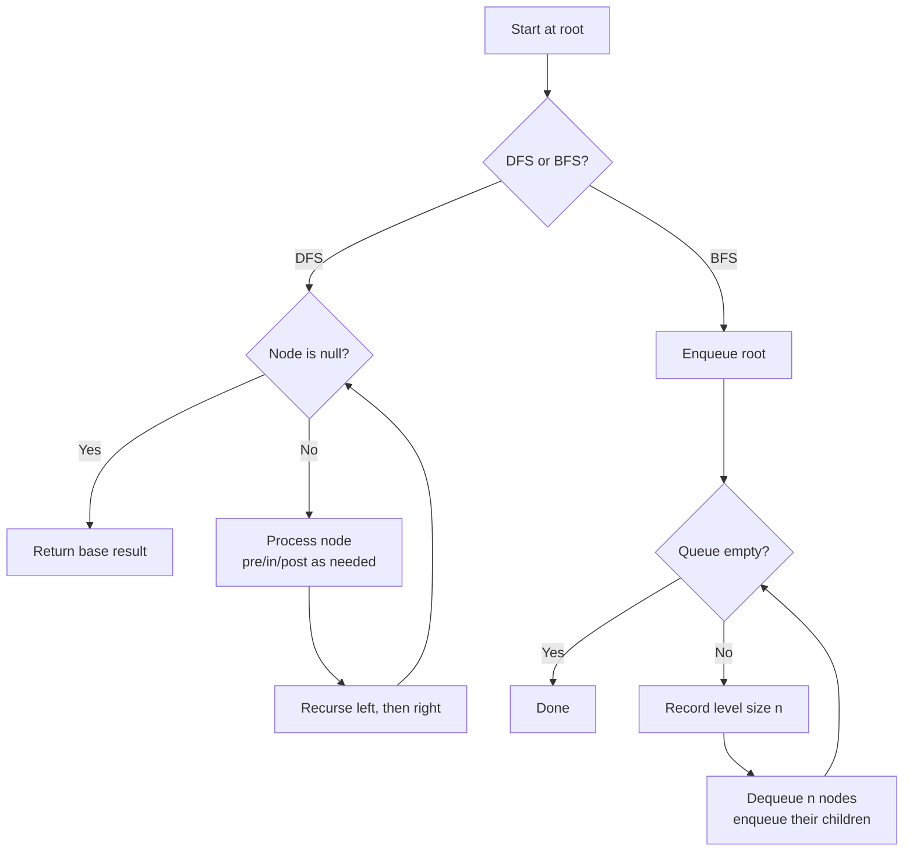

# Tree Traversal DFS & BFS Pattern

Use tree traversal when a problem asks you to *visit every node* of a binary tree in a specific order — depth-first (preorder/inorder/postorder) or breadth-first (level by level).

## When To Pick This Pattern

Reach for tree traversal when you notice:

- the input is a binary tree (or n-ary tree) and you must inspect every node
- you need node values in a particular order (sorted → BST inorder)
- you compute something bottom-up (height, subtree sums → postorder)
- you compute something top-down (path from root, depth → preorder)
- you process the tree "row by row" (level averages, right-side view → BFS)
- you compare or combine parent and child results (validate BST, LCA)

Ask yourself:

> "Do I need the answer for a node *before* or *after* I have its children's answers — and does order matter across a level?"

### Choose DFS vs BFS

| You need | Traversal |
|---|---|
| bottom-up aggregation (height, sums, "is balanced") | DFS postorder |
| sorted values from a BST | DFS inorder |
| root-first / path building | DFS preorder |
| shortest path in edges / shallowest node | BFS |
| per-level grouping (level order, zigzag, right view) | BFS with a queue |
| minimum depth (stop at first leaf) | BFS (short-circuits early) |

### When NOT To Use It

- the structure is a general graph with cycles — use [graph traversal](graph-traversal.md) with a visited set
- you only need one root-to-target path and can prune aggressively — plain DFS recursion still applies, but consider backtracking
- the "tree" is actually a linked list or array — use the simpler linear pattern

## Algorithm

DFS recurses into children (naturally using the call stack); BFS uses an explicit queue and drains one level at a time. Both visit each node exactly once.



Key discipline: for DFS decide *where* you do the work — before the recursive calls (preorder), between them (inorder), or after (postorder). For BFS, snapshot the queue count at the start of each level so children added mid-loop don't leak into the current level.

## Code (C#)

```csharp
public class TreeNode
{
    public int val;
    public TreeNode left;
    public TreeNode right;
    public TreeNode(int val = 0, TreeNode left = null, TreeNode right = null)
    {
        this.val = val;
        this.left = left;
        this.right = right;
    }
}
```

### DFS — recursive orders

```csharp
// Inorder (Left, Node, Right): yields BST values in sorted order.
// Time:  O(n) - each node visited once.
// Space: O(h) - recursion stack, h = tree height.
public static void Inorder(TreeNode node, IList<int> output)
{
    if (node == null) return;

    Inorder(node.left, output);   // all smaller values first
    output.Add(node.val);         // then this node
    Inorder(node.right, output);  // then all larger values
}

// Swap the line order for the other traversals:
//   Preorder:  Add, left, right   (root first)
//   Postorder: left, right, Add   (children first)
```

### DFS — iterative inorder with an explicit stack

```csharp
// Same result as recursive inorder without using the call stack.
// Time: O(n), Space: O(h).
public static IList<int> InorderIterative(TreeNode root)
{
    var output = new List<int>();
    var stack = new Stack<TreeNode>();
    TreeNode current = root;

    while (current != null || stack.Count > 0)
    {
        // Walk to the leftmost node, stacking the path.
        while (current != null)
        {
            stack.Push(current);
            current = current.left;
        }

        // Visit the node, then explore its right subtree.
        current = stack.Pop();
        output.Add(current.val);
        current = current.right;
    }

    return output;
}
```

### BFS — level order with a queue

```csharp
// Returns node values grouped by level (row by row).
// Time:  O(n), Space: O(w) - w = max width of the tree.
public static IList<IList<int>> LevelOrder(TreeNode root)
{
    var levels = new List<IList<int>>();
    if (root == null) return levels;

    var queue = new Queue<TreeNode>();
    queue.Enqueue(root);

    while (queue.Count > 0)
    {
        int levelSize = queue.Count;   // snapshot: nodes on THIS level
        var level = new List<int>();

        for (int i = 0; i < levelSize; i++)
        {
            TreeNode node = queue.Dequeue();
            level.Add(node.val);

            if (node.left != null) queue.Enqueue(node.left);
            if (node.right != null) queue.Enqueue(node.right);
        }

        levels.Add(level);
    }

    return levels;
}
```

### Max depth — DFS postorder aggregation

```csharp
// Height of the tree = 1 + max(child heights).
// Time: O(n), Space: O(h).
public static int MaxDepth(TreeNode root)
{
    if (root == null) return 0;
    return 1 + Math.Max(MaxDepth(root.left), MaxDepth(root.right));
}
```

### Validate BST — DFS carrying value bounds

```csharp
// Each node must lie strictly within (min, max); bounds tighten on descent.
// Time: O(n), Space: O(h). Use long bounds to handle int.MinValue/MaxValue nodes.
public static bool IsValidBST(TreeNode node, long min = long.MinValue, long max = long.MaxValue)
{
    if (node == null) return true;
    if (node.val <= min || node.val >= max) return false;

    return IsValidBST(node.left, min, node.val)    // right bound tightens
        && IsValidBST(node.right, node.val, max);  // left bound tightens
}
```

### Lowest Common Ancestor — DFS returning found nodes

```csharp
// LCA is the first node where p and q split into different subtrees
// (or a node that is itself p or q).
// Time: O(n), Space: O(h).
public static TreeNode LowestCommonAncestor(TreeNode root, TreeNode p, TreeNode q)
{
    if (root == null || root == p || root == q) return root;

    TreeNode left = LowestCommonAncestor(root.left, p, q);
    TreeNode right = LowestCommonAncestor(root.right, p, q);

    // Found targets on both sides -> this node is the split point.
    if (left != null && right != null) return root;

    // Otherwise bubble up whichever side found something.
    return left ?? right;
}
```

## Practice Tasks

Work these in rough order of difficulty:

1. **Maximum Depth of Binary Tree** — deepest leaf distance. (DFS postorder)
2. **Binary Tree Level Order Traversal** — values grouped per level. (BFS with level-size snapshot)
3. **Same Tree** — are two trees identical? (parallel DFS)
4. **Binary Tree Right Side View** — last node of each level. (BFS, take last of each row)
5. **Validate Binary Search Tree** — enforce BST ordering. (DFS with bounds or inorder monotonicity)
6. **Lowest Common Ancestor of a Binary Tree** — split point of two nodes. (DFS returning found flags)
7. **Binary Tree Zigzag Level Order Traversal** — alternate direction per level. (BFS + reverse toggle)
8. **Serialize and Deserialize Binary Tree** — encode to string and back. (preorder DFS or BFS with null markers)
9. **Binary Tree Maximum Path Sum** — best path through any nodes. (DFS postorder returning best downward gain)

## Related Patterns

- [Graph Traversal](graph-traversal.md) — trees are acyclic graphs; DFS/BFS generalize once cycles and a visited set appear.
- [Heap / Priority Queue](heap-priority-queue.md) — pairs with BFS for weighted shortest paths and "k closest" on trees.
- [Union-Find](union-find.md) — an alternative for connectivity questions that don't need explicit traversal.
