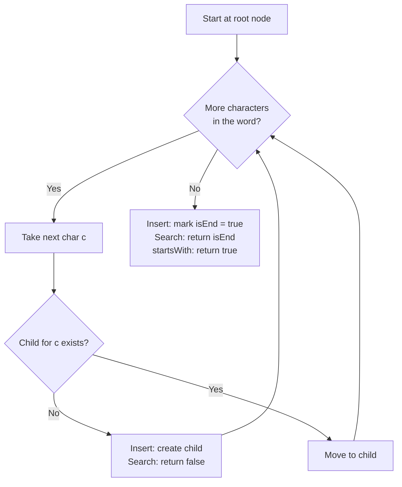

# Trie / Prefix Tree Pattern

Use a trie when you have many strings and repeatedly ask *"is this word / prefix present?"* — it shares common prefixes so lookups cost `O(length)` regardless of how many words you store.

## When To Pick This Pattern

Reach for a trie when you notice:

- many words that share prefixes ("cat", "car", "card")
- prefix queries: autocomplete, "does any word start with `pre`?"
- word-existence checks faster than scanning a list
- wildcard / pattern matching over a dictionary (`.` matches any letter)
- searching a board/grid for many words at once (Word Search II)

Ask yourself:

> "Am I doing lots of prefix or membership queries over a set of strings, where sharing common prefixes would save time or space?"

### Trie vs Hash Set

| You need | Use |
|---|---|
| exact word membership only | [hash set](hash-map-set.md) (`O(1)` average) |
| prefix queries / autocomplete | Trie |
| enumerate all words with a prefix | Trie (walk the subtree) |
| wildcard matching across a dictionary | Trie (DFS with branching on `.`) |

### When NOT To Use It

- you only ever test full-word membership — a `HashSet<string>` is simpler and faster
- the alphabet is huge and words are few — per-node child maps waste memory
- strings share little prefix structure — the trie degenerates and offers no saving

## Algorithm

A trie is a tree of characters: each edge is a letter, each path from the root spells a prefix, and a boolean flag marks where a complete word ends. Insert, search, and prefix-check all walk down one node per character.



Key discipline: **`search` requires the `isEnd` flag; `startsWith` does not.** Reaching the last character only proves the prefix exists — it is a word only if that node was explicitly marked as a word ending.

## Code (C#)

### Trie with insert / search / startsWith

```csharp
// Prefix tree over lowercase letters (swap the map for other alphabets).
// Let L = word length. Insert/Search/StartsWith are all O(L) time.
// Space: O(total characters inserted).
public class Trie
{
    private class Node
    {
        // Child per character; using a dictionary keeps it alphabet-agnostic.
        public Dictionary<char, Node> Children = new();
        public bool IsEnd;   // true if a word ends exactly here
    }

    private readonly Node _root = new();

    // Adds a word to the trie.
    public void Insert(string word)
    {
        Node node = _root;
        foreach (char c in word)
        {
            if (!node.Children.TryGetValue(c, out var next))
            {
                next = new Node();
                node.Children[c] = next; // create the missing branch
            }
            node = next;
        }
        node.IsEnd = true;               // mark the full word
    }

    // True only if the exact word was inserted.
    public bool Search(string word)
    {
        Node node = Walk(word);
        return node != null && node.IsEnd; // must be a marked word end
    }

    // True if any inserted word has this prefix.
    public bool StartsWith(string prefix)
    {
        return Walk(prefix) != null;       // reaching the node is enough
    }

    // Follows the path for s; returns the final node or null if it breaks.
    private Node Walk(string s)
    {
        Node node = _root;
        foreach (char c in s)
        {
            if (!node.Children.TryGetValue(c, out node))
                return null;
        }
        return node;
    }
}
```

### Word Dictionary — search with `.` wildcards

```csharp
// Supports '.' which matches any single character. Backed by a Trie.
// Time: O(L) for concrete words; O(26^L) worst case when full of wildcards.
public class WordDictionary
{
    private class Node
    {
        public Dictionary<char, Node> Children = new();
        public bool IsEnd;
    }

    private readonly Node _root = new();

    public void AddWord(string word)
    {
        Node node = _root;
        foreach (char c in word)
        {
            if (!node.Children.TryGetValue(c, out var next))
                node.Children[c] = next = new Node();
            node = next;
        }
        node.IsEnd = true;
    }

    public bool Search(string word) => Dfs(word, 0, _root);

    private bool Dfs(string word, int i, Node node)
    {
        if (i == word.Length) return node.IsEnd;

        char c = word[i];
        if (c == '.')
        {
            // Wildcard: try every branch.
            foreach (var child in node.Children.Values)
                if (Dfs(word, i + 1, child)) return true;
            return false;
        }

        // Concrete character: follow the single matching branch.
        return node.Children.TryGetValue(c, out var next) && Dfs(word, i + 1, next);
    }
}
```

### Autocomplete & Word Search II (brief)

- **Autocomplete:** walk to the node for the typed prefix with `Walk`, then DFS the subtree collecting every path that hits an `IsEnd` node — those are the completions.
- **Word Search II:** build one trie from *all* target words, then DFS the board once; at each cell descend the trie in lockstep with the grid, pruning the instant no child matches. This beats searching each word separately because shared prefixes are explored only once.

## Practice Tasks

Work these in rough order of difficulty:

1. **Implement Trie (Prefix Tree)** — insert / search / startsWith. (core structure)
2. **Longest Common Prefix** — shared prefix of all strings. (insert all, descend while single child)
3. **Index Pairs of a String** — find dictionary words inside text. (trie of words, scan positions)
4. **Design Add and Search Words Data Structure** — support `.` wildcard. (trie + DFS branching)
5. **Replace Words** — swap words with their shortest root. (trie of roots, stop at first `IsEnd`)
6. **Map Sum Pairs** — sum values of all keys with a prefix. (trie storing values, subtree sum)
7. **Search Suggestions System** — top-3 products per typed prefix. (trie or sorted list + prefix walk)
8. **Word Search II** — find all dictionary words on a board. (trie + grid DFS with pruning)
9. **Maximum XOR of Two Numbers in an Array** — best XOR pair. (binary trie of bits, greedy descent)

## Related Patterns

- [Hash Map / Hash Set](hash-map-set.md) — the simpler choice when you only need exact membership.
- [Tree Traversal](tree-traversal.md) — a trie is a tree; DFS its subtrees to enumerate words.
- [Graph Traversal](graph-traversal.md) — Word Search II combines a trie with grid DFS.
