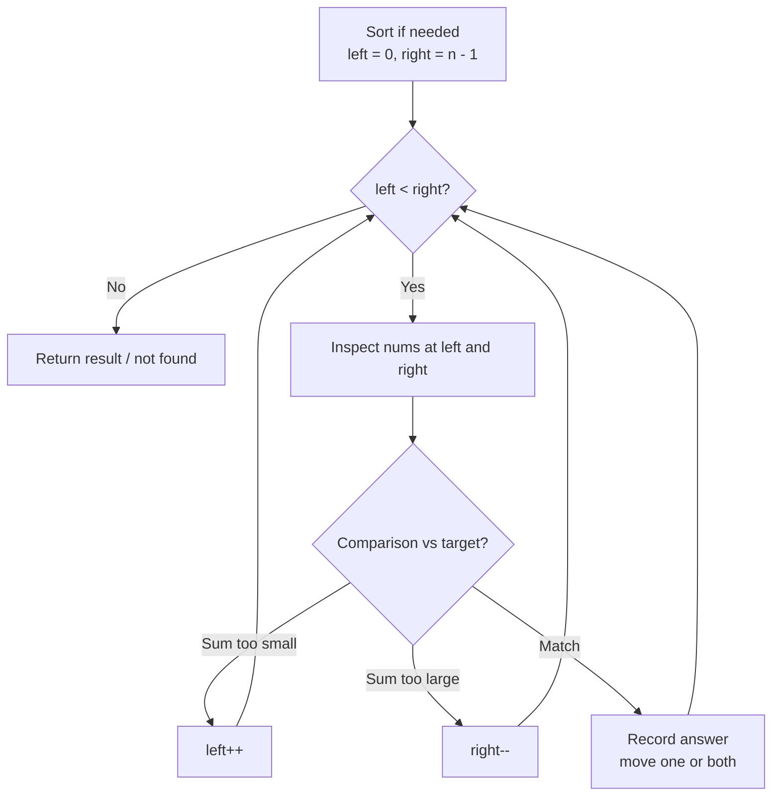

# Two Pointers Pattern

Use two pointers when a linear scan with a single index is not enough and two positions moving in a coordinated way can find the answer in `O(n)` time and `O(1)` space.

## When To Pick This Pattern

Reach for two pointers when you notice:

- the input is **sorted** (or can be sorted cheaply) and you search by value
- you compare or combine elements from **opposite ends** (`target` sum, container area)
- you need to **reverse**, swap, or mirror elements in place
- you **partition** an array around a pivot or condition (evens/odds, zeros)
- you **remove duplicates** or unwanted elements in place with a write pointer
- you want to avoid the `O(n)` extra space a hash map would cost

Ask yourself:

> "Can I decide which end to move next using only the values the two pointers point at?"

### Two Flavours

| Layout | Pointer motion | Typical use |
|---|---|---|
| opposite ends | `left++` / `right--` toward each other | sorted two-sum, reverse, container with most water |
| same direction | slow write + fast read | remove duplicates, partition, move zeroes |

### When NOT To Use It

- input is unsorted and the relative order matters for correctness (sorting would destroy it)
- you need arbitrary value lookup — a [hash map](hash-map-set.md) gives `O(1)` average instead
- the decision to move a pointer needs global state a window would track better — see [Sliding Window](sliding-window.md)
- more than two independent positions are required and they do not reduce to nested two-pointer scans

## Algorithm

Place pointers at the ends (or both at the start), then repeatedly inspect the pointed values and move exactly one pointer inward based on a comparison, shrinking the search space every step.



Key discipline: **each iteration must move at least one pointer**, so the gap always shrinks and the loop terminates in `O(n)`.

## Code (C#)

### Sorted Two Sum — opposite ends

```csharp
// Returns 1-based indices of two values in a SORTED array summing to target.
// Time:  O(n) - each pointer moves inward at most n times total.
// Space: O(1) - no auxiliary structures.
public static int[] TwoSumSorted(int[] numbers, int target)
{
    int left = 0, right = numbers.Length - 1;

    while (left < right)
    {
        int sum = numbers[left] + numbers[right];

        if (sum == target)
        {
            return new[] { left + 1, right + 1 };
        }
        else if (sum < target)
        {
            left++;   // need a larger sum -> advance the small end
        }
        else
        {
            right--;  // need a smaller sum -> retreat the large end
        }
    }

    return Array.Empty<int>();
}
```

### Reverse in place — opposite ends swap

```csharp
// Reverses the array in place by swapping mirrored elements.
// Time: O(n), Space: O(1).
public static void Reverse(int[] nums)
{
    int left = 0, right = nums.Length - 1;

    while (left < right)
    {
        (nums[left], nums[right]) = (nums[right], nums[left]);
        left++;
        right--;
    }
}
```

### Remove duplicates from sorted array — slow/fast same direction

```csharp
// Compacts unique values to the front of a SORTED array; returns new length.
// slow = write position of the next unique value; fast = scan pointer.
// Time: O(n) - single scan. Space: O(1) - in place.
public static int RemoveDuplicates(int[] nums)
{
    if (nums.Length == 0) return 0;

    int slow = 0; // nums[0..slow] are the unique values found so far

    for (int fast = 1; fast < nums.Length; fast++)
    {
        // A new value appears -> write it just after the last unique one.
        if (nums[fast] != nums[slow])
        {
            slow++;
            nums[slow] = nums[fast];
        }
    }

    return slow + 1;
}
```

### Container With Most Water — greedy opposite ends

```csharp
// Max area of water between two lines.
// Move the SHORTER wall inward: it caps the area, so keeping it can only lose.
// Time: O(n), Space: O(1).
public static int MaxArea(int[] height)
{
    int left = 0, right = height.Length - 1, best = 0;

    while (left < right)
    {
        int width = right - left;
        int area = width * Math.Min(height[left], height[right]);
        best = Math.Max(best, area);

        if (height[left] < height[right])
        {
            left++;
        }
        else
        {
            right--;
        }
    }

    return best;
}
```

### 3Sum — fix one, two-pointer the rest

```csharp
// All unique triplets summing to zero.
// Sort, fix nums[i], then two-pointer search the suffix.
// Time: O(n^2), Space: O(1) beyond the output (ignoring sort).
public static IList<IList<int>> ThreeSum(int[] nums)
{
    Array.Sort(nums);
    var result = new List<IList<int>>();

    for (int i = 0; i < nums.Length - 2; i++)
    {
        // Skip duplicate anchors to avoid repeated triplets.
        if (i > 0 && nums[i] == nums[i - 1]) continue;

        int left = i + 1, right = nums.Length - 1;

        while (left < right)
        {
            int sum = nums[i] + nums[left] + nums[right];

            if (sum < 0)
            {
                left++;
            }
            else if (sum > 0)
            {
                right--;
            }
            else
            {
                result.Add(new List<int> { nums[i], nums[left], nums[right] });
                left++;
                right--;
                // Skip duplicate values on both sides.
                while (left < right && nums[left] == nums[left - 1]) left++;
                while (left < right && nums[right] == nums[right + 1]) right--;
            }
        }
    }

    return result;
}
```

## Practice Tasks

Work these in rough order of difficulty:

1. **Valid Palindrome** — ignore non-alphanumerics, compare inward. (opposite ends)
2. **Two Sum II - Input Array Is Sorted** — indices summing to target. (opposite ends)
3. **Remove Duplicates from Sorted Array** — compact in place. (slow/fast)
4. **Move Zeroes** — push zeros to the end, keep order. (slow write pointer)
5. **Reverse String** — reverse a char array in place. (opposite ends swap)
6. **Container With Most Water** — max area between lines. (greedy, move shorter side)
7. **3Sum** — unique triplets summing to zero. (fix one + two pointers)
8. **Sort Colors** — Dutch national flag partition. (three pointers)
9. **Trapping Rain Water** — total trapped water. (two pointers with running maxes)

## Related Patterns

- [Sliding Window](sliding-window.md) — a specialised same-direction two-pointer over a contiguous window.
- [Fast & Slow Pointers](fast-slow-pointers.md) — two pointers at different speeds for cycle problems.
- [Hash Map / Hash Set](hash-map-set.md) — the unsorted alternative for pair/complement search.
