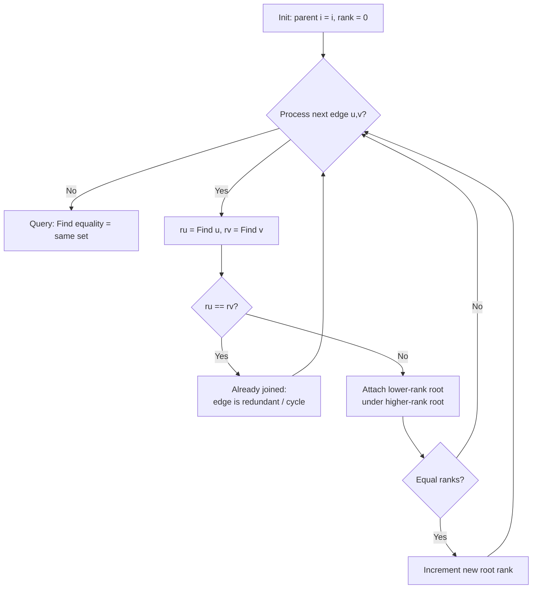

# Union-Find / Disjoint Set Union Pattern

Use Union-Find when you must repeatedly *merge groups* and *ask whether two items are in the same group* — connectivity queries in near-constant amortized time, without walking the graph each time.

## When To Pick This Pattern

Reach for Union-Find when you notice:

- dynamic connectivity: edges arrive over time and you ask "connected yet?"
- counting connected components / provinces / friend circles
- detecting the edge that creates a cycle (redundant connection)
- grouping equivalent items (accounts merge, equations `a==b`)
- Kruskal's minimum spanning tree (pick cheapest edge if it joins two sets)

Ask yourself:

> "Do I only care *which group* things belong to and whether groups merge — not the actual path between them?"

### Union-Find vs Traversal

| You need | Use |
|---|---|
| "same component?" with edges added incrementally | Union-Find |
| the actual path / distance between nodes | [graph traversal](graph-traversal.md) (BFS/DFS) |
| components of a fixed graph, one pass | either — DFS is fine |
| repeated merge + query interleaved | Union-Find (amortized near `O(1)`) |

### When NOT To Use It

- you need the path, distance, or ordering — Union-Find only knows *membership*
- edges are removed over time — DSU handles unions, not splits
- the graph is directed and you need reachability — use traversal or [topological sort](topological-sort.md)

## Algorithm

Each element points to a parent; a set is identified by its root. `Find` walks to the root (compressing the path as it goes); `Union` links the two roots, attaching the shorter tree under the taller (union by rank) to keep trees flat.



Key discipline: **path compression during `Find` plus union by rank** gives `O(alpha(n))` amortized per operation — effectively constant. Skipping either degrades toward `O(log n)` or worse.

## Code (C#)

### Core disjoint-set structure

```csharp
// Disjoint Set Union with path compression + union by rank.
// Operations: near O(alpha(n)) amortized ~ O(1).
// Space: O(n).
public class UnionFind
{
    private readonly int[] parent;
    private readonly int[] rank;
    public int Count { get; private set; } // number of disjoint sets

    public UnionFind(int n)
    {
        parent = new int[n];
        rank = new int[n];
        Count = n;
        for (int i = 0; i < n; i++) parent[i] = i; // each element its own set
    }

    // Returns the representative root of x, compressing the path.
    public int Find(int x)
    {
        while (parent[x] != x)
        {
            parent[x] = parent[parent[x]]; // path compression (halving)
            x = parent[x];
        }
        return x;
    }

    // Merges the sets of a and b. Returns false if already joined.
    public bool Union(int a, int b)
    {
        int ra = Find(a), rb = Find(b);
        if (ra == rb) return false; // same set -> would form a cycle

        // Attach the smaller-rank tree under the larger-rank root.
        if (rank[ra] < rank[rb]) (ra, rb) = (rb, ra);
        parent[rb] = ra;
        if (rank[ra] == rank[rb]) rank[ra]++;

        Count--; // two sets became one
        return true;
    }

    public bool Connected(int a, int b) => Find(a) == Find(b);
}
```

### Number of Provinces — components via unions

```csharp
// isConnected[i][j] == 1 means city i and j are directly linked.
// Time: O(n^2 * alpha(n)), Space: O(n).
public static int FindCircleNum(int[][] isConnected)
{
    int n = isConnected.Length;
    var uf = new UnionFind(n);

    for (int i = 0; i < n; i++)
        for (int j = i + 1; j < n; j++)
            if (isConnected[i][j] == 1)
                uf.Union(i, j);

    return uf.Count; // each remaining set is one province
}
```

### Redundant Connection — first edge that closes a cycle

```csharp
// In a graph built from a tree plus one extra edge, find that extra edge.
// The redundant edge is the first whose endpoints are already connected.
// Time: O(n * alpha(n)), Space: O(n).
public static int[] FindRedundantConnection(int[][] edges)
{
    var uf = new UnionFind(edges.Length + 1); // nodes are 1-indexed

    foreach (var e in edges)
    {
        // Union returns false when both ends share a root already.
        if (!uf.Union(e[0], e[1]))
            return e;
    }

    return Array.Empty<int>();
}
```

### Kruskal MST (brief)

Union-Find is the engine behind **Kruskal's minimum spanning tree**: sort all edges by weight ascending, then scan them, calling `Union` on each. If the endpoints are already connected (`Union` returns false) the edge would create a cycle, so skip it; otherwise accept it into the tree. Stop once `n - 1` edges are accepted. Total cost is `O(E log E)`, dominated by the sort.

## Practice Tasks

Work these in rough order of difficulty:

1. **Number of Provinces** — count friend circles. (union every connected pair)
2. **Number of Connected Components in an Undirected Graph** — union edges, count sets. (Count field)
3. **Redundant Connection** — the extra edge forming a cycle. (first failing union)
4. **Graph Valid Tree** — is it connected and acyclic? (n-1 edges, no union collision)
5. **Accounts Merge** — merge accounts sharing an email. (union emails to owner index)
6. **Number of Operations to Make Network Connected** — reconnect components. (extra edges vs components - 1)
7. **Most Stones Removed with Same Row or Column** — max removable stones. (union by shared row/column)
8. **Satisfiability of Equality Equations** — process `==` then check `!=`. (union equals, verify not-equals)
9. **Smallest String With Swaps** — sort within swap-connected groups. (union indices, sort each set)

## Related Patterns

- [Graph Traversal](graph-traversal.md) — the alternative for connectivity when you also need paths or distances.
- [Topological Sort](topological-sort.md) — for directed dependency ordering rather than undirected merging.
- [Heap / Priority Queue](heap-priority-queue.md) — sorts or selects edges for Kruskal's MST.
