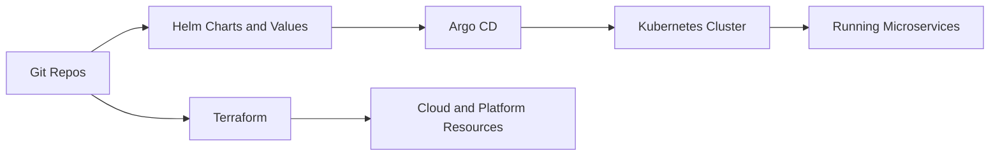
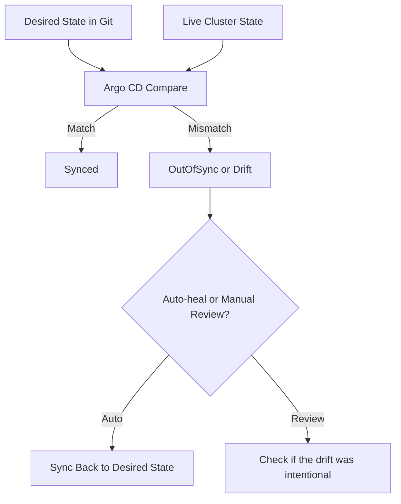

# Declarative Delivery For Microservices

When many microservices run on Kubernetes, operations become safer only if the delivery model is clear.

Without a clear boundary between infrastructure provisioning, application packaging, deployment reconciliation, and runtime behavior, teams end up with overlapping tools, manual hotfixes, and hard-to-debug drift.

This topic uses a practical tool-specific model:

- Terraform provisions infrastructure and shared platform prerequisites
- Helm packages application manifests and configuration structure
- Argo CD reconciles Git state into Kubernetes clusters
- Kubernetes enforces runtime desired state

## Why This Topic Matters

Microservices do not fail only because code is wrong. They also fail because:

- environments drift apart
- one service is deployed with the wrong values
- manual `kubectl` changes bypass Git
- rollback is not actually safe
- migrations run in the wrong order
- production and staging are shaped differently without intention

A declarative delivery model reduces these problems by making intended state visible, reviewable, and auditable.

## The Responsibility Split

The most important thing to understand is that these tools solve different layers of the delivery chain.

### Terraform

Terraform should usually provision or manage:

- cloud resources
- Kubernetes clusters or cluster prerequisites
- databases, DNS, networking, storage classes, load balancers, IAM, and other platform dependencies
- sometimes Argo CD or supporting platform add-ons themselves

Terraform is strongest when the target is infrastructure or shared platform resources exposed through APIs.

It is usually the wrong primary tool for managing day-to-day microservice rollout state inside Kubernetes.

### Helm

Helm packages Kubernetes application manifests into a chart with:

- templates
- default values
- optional schema validation
- release-oriented packaging

Helm is useful when many microservices share repeatable manifest shapes but differ by values such as:

- image tag
- replica count
- service ports
- resource requests and limits
- ingress hostnames
- feature flags or environment-specific settings

Helm does not replace Kubernetes or GitOps. It is a packaging and rendering layer.

### Argo CD

Argo CD is a GitOps delivery controller for Kubernetes. It watches a Git-defined desired state and continuously compares it to live cluster state.

It is strong at:

- sync from Git to cluster
- drift detection
- health reporting
- optional auto-sync, prune, and self-heal
- auditability of application delivery

Argo CD should usually own application deployment state inside the cluster when the team adopts GitOps.

### Kubernetes

Kubernetes is the runtime enforcement layer. It schedules Pods, runs controllers, manages services, and reconciles workload state within the cluster.

Kubernetes is not your source of truth. In a healthy declarative delivery model, Git is.

## The Practical Boundary Rule

Use this rule of thumb:

- if it provisions infrastructure, Terraform is a likely fit
- if it shapes Kubernetes application manifests, Helm is a likely fit
- if it continuously syncs Git-defined app state to the cluster, Argo CD is a likely fit
- if it keeps workloads running and reachable, Kubernetes is doing the runtime part

This rule avoids one of the most common platform mistakes: using every tool for everything.

## GitOps As The Operating Model

GitOps is not just “deploy from Git.”

It means:

- Git holds the desired application state
- reconciler tools compare live state to Git state
- drift becomes visible
- deploy history becomes reviewable and auditable
- rollback usually means moving desired state back to a known-good version

For many microservices, GitOps matters because manual deployment and hotfix habits do not scale well across services and environments.

## Desired State And Drift

Desired state is the state you intend the system to have.

Drift is when the live cluster no longer matches that intended state.

Drift can happen because of:

- manual `kubectl patch` or `kubectl edit`
- emergency changes made only in production
- Helm value mismatches across environments
- incomplete revert procedures
- controller-managed resources being modified outside the expected workflow

In a GitOps system, drift should be detected quickly and either:

- corrected automatically
- corrected by a deliberate sync
- investigated because the live state changed for a valid emergency reason

## Helm In A Microservice Platform

Helm is most useful when you want reusable application delivery shapes.

Typical Helm use in microservices:

- one chart per service
- one shared base chart pattern reused by many services
- environment-specific values files
- schema validation for values

Good Helm practices here:

- keep values predictable and documented
- avoid over-templating for cleverness alone
- keep chart outputs close to ordinary Kubernetes manifests
- make it obvious which values differ by environment

### Values Layering

For example, values can layer like this:

- base defaults in `values.yaml`
- environment overrides in `values-staging.yaml` or `values-prod.yaml`
- carefully controlled overrides from Argo CD or CI metadata when truly needed

If values layering becomes opaque, delivery becomes hard to reason about.

## Argo CD Sync, Health, And Safety

Argo CD introduces a few important operational states:

- `Synced` vs `OutOfSync`
- `Healthy` vs `Degraded`
- automated vs manual sync
- prune and self-heal behavior

Important nuance:

- a service can be `Synced` but still `Degraded`
- a rollout can be applied correctly from Git while the application still fails readiness or runtime checks

That is why GitOps does not replace production operations. It makes delivery state more visible, but runtime health still needs Kubernetes probes, metrics, logs, and traces.

## Promotion And Rollback

Microservice promotion should be deliberate.

Typical promotion flow:

1. change chart or values in a lower environment
2. verify sync and runtime health
3. promote the same known-good change to the next environment

Rollback is easy only when:

- contracts are backward compatible
- schema changes are safe to reverse or tolerate older code
- values changes do not require live irreversible data transforms

Rollback becomes hard when the system changed in ways that the old version cannot understand.

## Migrations And Ordering

Database or event-schema changes are one of the biggest reasons declarative delivery gets messy.

High-level rule:

- use additive, backward-compatible changes first
- deploy app versions that can handle both old and new states when possible
- use ordered hooks or separate migration Jobs carefully
- never treat schema changes as an afterthought to rollout safety

In a Helm and Argo CD setup, hooks and sync waves can help, but they should be used conservatively and with clear ownership.

## Troubleshooting Section

### Common Failure Modes

#### App is `OutOfSync`

Check:

- was there a manual change in the cluster
- did Git change but sync never happen
- are generated manifests different because of values or chart changes

#### App is `Synced` but `Degraded`

Check:

- Kubernetes rollout status
- readiness and liveness failures
- bad image tag or missing config
- failed migration or dependency startup

#### Auto-prune removed something important

Check:

- whether the resource was truly meant to leave Git
- whether a generated resource changed names unexpectedly
- whether ownership boundaries in the repo are too broad

#### Rollback from Git did not restore service health

Check:

- irreversible database changes
- incompatible event or message contracts
- environment-specific config drift that was never committed
- secrets or external dependencies changed outside the repo

#### Helm render is valid but runtime still fails

Check:

- values are syntactically valid but semantically wrong
- probes or resource settings are too aggressive
- ingress, service, or secret references point to the wrong target

### Operational Heuristic

When delivery fails, narrow the problem in this order:

1. Git state
2. rendered manifests
3. Argo CD sync state
4. Kubernetes rollout state
5. application runtime health

This prevents jumping straight into logs when the real problem is simply the wrong rendered configuration.

## Interview Heuristics

Strong answers usually do these things:

- clearly separate Terraform, Helm, Argo CD, and Kubernetes responsibilities
- explain GitOps as reconciliation, not only deployment automation
- distinguish drift from runtime health failure
- mention why `kubectl` hotfixes are risky in GitOps-managed systems
- explain that rollback safety depends on contracts and data changes, not only Git history

If your answer shows tool boundaries and operational trade-offs, it will sound practical rather than buzzword-heavy.
