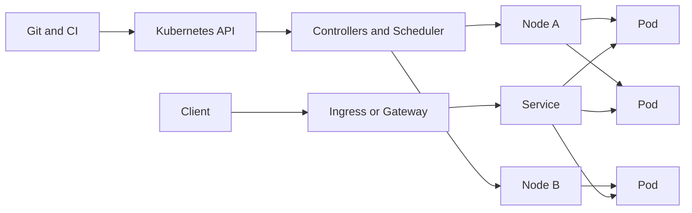
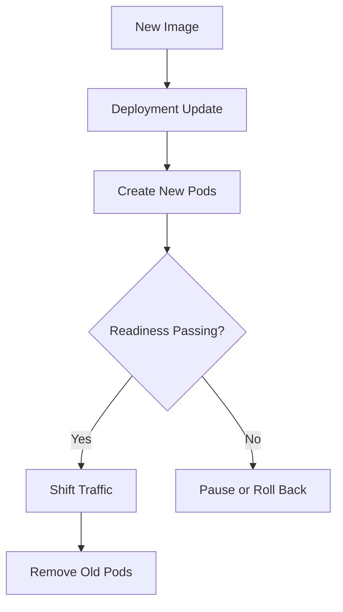

# Kubernetes For Microservices

Kubernetes is the most common control plane for running microservices in production. It is not just a container launcher. It is a declarative system that keeps actual cluster state moving toward desired state.

For microservices, that matters because deployment, service discovery, scaling, and recovery all need to happen across many independently changing components.

## Why Kubernetes Fits Microservices

Kubernetes is useful for microservices because it gives a common platform for:

- packaging and running services as containers
- keeping desired replica count available
- stable service discovery and traffic routing
- safe rolling updates and rollbacks
- scaling workloads up and down
- applying consistent configuration and secrets handling
- enforcing runtime policies around security and networking

The trade-off is platform complexity. Kubernetes is most helpful when the team actually needs operational consistency across many services.

## Desired State And Cluster Model

Official Kubernetes terminology uses **control plane** and **nodes** rather than the older `master` and `worker` wording.

The control plane stores desired state and runs controllers that reconcile the cluster toward that state. Nodes run the actual workloads.



This model is important in interviews because Kubernetes is fundamentally about reconciliation, not manual server management.

## Workload Building Blocks

### Pods

A Pod is the smallest deployable unit. It can contain one container or a tightly related set of containers that share networking and storage context.

In production microservices, you normally do not manage Pods directly. You manage them through controllers.

### Deployments And ReplicaSets

Use Deployments for stateless microservices such as APIs, BFFs, background consumers, and internal HTTP services.

Deployments manage ReplicaSets, and ReplicaSets ensure the desired number of Pods stays available.

### StatefulSets

Use StatefulSets when the workload needs stable identity or persistent storage, such as a database, broker, or a stateful internal service that cannot be treated like disposable replicas.

### DaemonSets

Use DaemonSets for node-level agents such as log shippers, metrics agents, security agents, or service-mesh components that must run on many or all nodes.

### Jobs And CronJobs

Use Jobs and CronJobs for run-to-completion tasks such as:

- database migrations
- data backfills
- cleanup tasks
- scheduled backups

For microservices, this is usually better than baking one-off operational tasks into long-running services.

## Networking And Traffic Flow

### Services

Services give a stable virtual endpoint for Pods selected by labels. They decouple callers from changing Pod IPs.

Common service types:

- `ClusterIP` for internal service-to-service traffic
- `NodePort` mainly for simpler exposure and some development use cases
- `LoadBalancer` when the environment provisions an external load balancer
- `ExternalName` for DNS-based indirection to an external dependency

Under the hood, modern Kubernetes service routing uses selectors and EndpointSlices.

### Ingress And Gateway API

Ingress handles HTTP and HTTPS entry into the cluster, but it requires an Ingress Controller such as NGINX or Traefik.

Gateway API is the newer, more expressive traffic-management model and is worth knowing because many older interview summaries stop at Ingress.

### DNS

Kubernetes DNS lets services discover each other by stable names instead of hardcoded IPs. For microservices, this is what makes internal service naming practical at scale.

## Configuration, Secrets, And Identity

Use ConfigMaps for non-sensitive configuration and Secrets for sensitive values.

Important distinction:

- Namespaces organize and scope resources
- Secrets store confidential data
- ServiceAccounts provide workload identity inside the cluster
- RBAC controls what that identity can access

Microservices should not share one over-permissioned ServiceAccount by default.

## Health, Self-Healing, And Safe Rollouts

### Probes

Kubernetes has three important probe types:

- liveness: should the process be restarted
- readiness: should this Pod receive traffic right now
- startup: is the application still booting

For production microservices, readiness is often the most important traffic-safety control.

### Rolling Updates

Deployments support rolling updates with settings like `maxUnavailable` and `maxSurge`.

Safe rollout depends on more than changing the image tag. It also depends on:

- backward-compatible contracts
- correct readiness behavior
- safe database change sequencing
- clear rollback path



## Resource Management And Scaling

### Requests And Limits

Requests help the scheduler place Pods on nodes. Limits cap maximum resource use.

For microservices, missing or unrealistic requests and limits create noisy-neighbor problems, eviction risk, and unstable autoscaling behavior.

### Autoscaling

Know the difference between these:

- Horizontal Pod Autoscaler: scales replica count
- Vertical Pod Autoscaler: adjusts requested resources
- Cluster Autoscaler: scales node capacity

HPA is usually the first scaling mechanism used for stateless microservices.

## Security And Isolation

### Namespaces

Namespaces are logical scopes for teams, apps, or environments. They do **not** automatically provide network isolation.

### NetworkPolicies

NetworkPolicies define which traffic is allowed between Pods and namespaces. In a microservices platform, they reduce accidental exposure and tighten service-to-service paths.

### Pod Security And RBAC

At minimum, know these ideas:

- use least privilege with RBAC
- avoid broad ServiceAccount access
- apply Pod Security Standards or equivalent controls
- separate application permissions from platform-admin permissions

## Troubleshooting Section

Kubernetes troubleshooting for microservices should narrow the problem from user symptom to platform object quickly.

Start with these questions:

1. Is the Pod failing, or is traffic failing to reach a healthy Pod?
2. Is the issue caused by image, config, scheduling, networking, or rollout?
3. Did the problem start after a deploy or infrastructure change?
4. Is the issue local to one service or shared across several services?

### Common Failure Patterns

#### Pod stuck in `Pending`

Usually check:

- resource requests too high for available nodes
- node selectors, affinities, taints, or tolerations
- missing volumes or unsatisfied storage claims

#### `CrashLoopBackOff`

Usually check:

- startup command failures
- missing config or secrets
- dependency assumptions during boot
- liveness probe killing the process too early

#### Service has no working backends

Usually check:

- label mismatch between Service selector and Pod labels
- readiness failing, so endpoints are not considered ready
- rollout created Pods, but they never became traffic-ready

#### Ingress exists but traffic still fails

Usually check:

- Ingress Controller actually installed
- host and path rules
- backend service name and port
- TLS secret and certificate configuration

#### Slow rollout or stalled deploy

Usually check:

- readiness never passing
- image pull errors
- insufficient cluster capacity
- PodDisruptionBudget or scaling constraints

### Useful First Commands

```bash
kubectl get pods -A
kubectl describe pod <pod-name>
kubectl logs <pod-name> --previous
kubectl get svc,endpointslices
kubectl rollout status deployment/<name>
kubectl get events --sort-by=.metadata.creationTimestamp
```

These commands help distinguish between workload failure, service routing issues, and rollout problems.

## Interview Heuristics

Strong Kubernetes answers in a microservices context usually do these things:

- talk about Deployments instead of managing Pods directly
- distinguish control plane from nodes
- explain why readiness matters for safe traffic
- separate namespace scoping from real network isolation
- mention Ingress Controllers, not only Ingress resources
- explain autoscaling as more than just HPA

If you keep Kubernetes tied to microservice delivery and runtime safety, your answers stay more practical and less encyclopedic.
