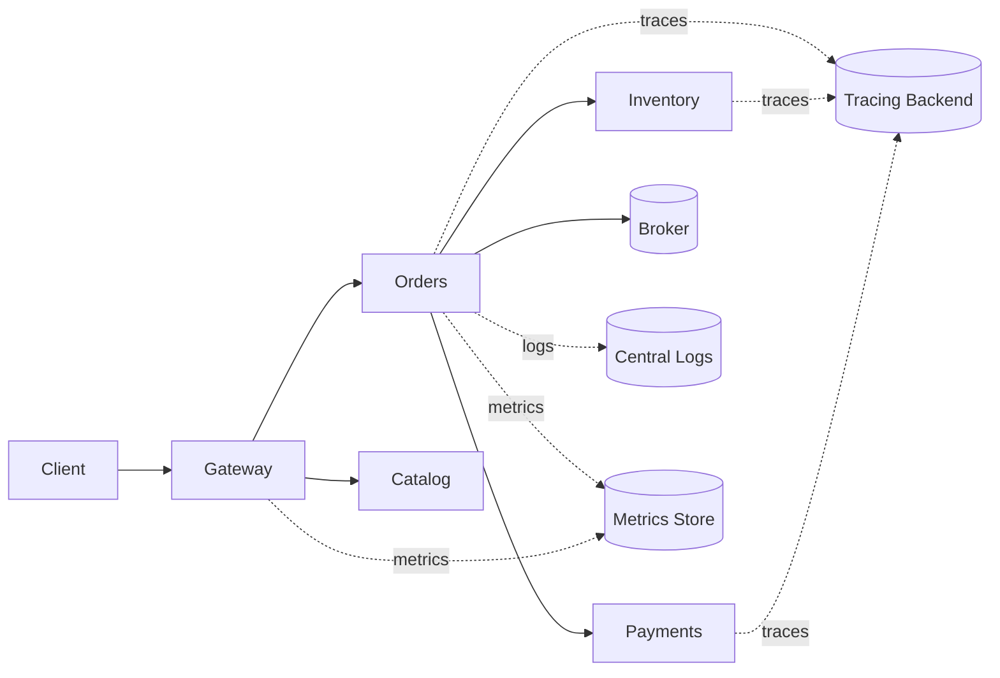
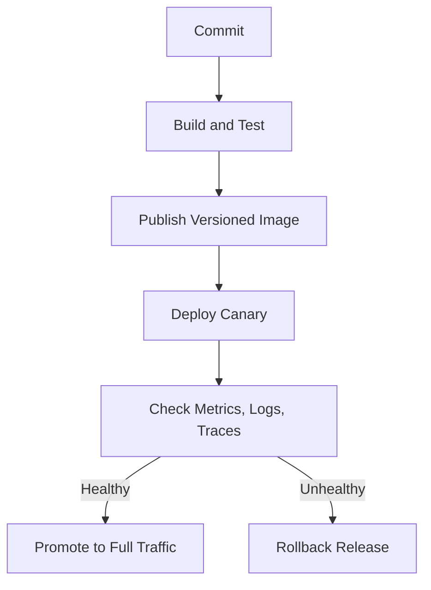
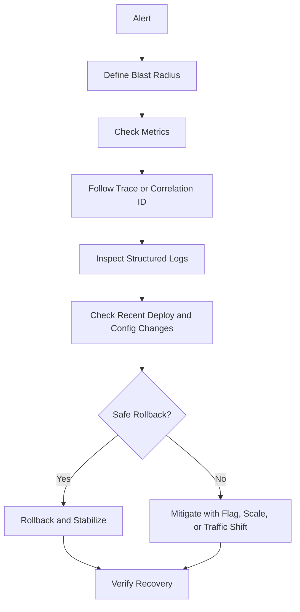

# Microservices Production Operations

Production operations for microservices are mostly about controlling blast radius and shortening time to understanding.

The same architecture that looks clean in diagrams can become hard to run if the team cannot answer basic production questions quickly:

- which service is failing
- which requests are affected
- whether the issue started after a deploy
- whether the issue is code, config, traffic, dependency, or infrastructure
- how to roll back safely

## What Changes In Production

In development, the hardest problem is usually building the feature.

In production, the harder problems are:

- observing behavior across multiple services
- handling partial failure under real traffic
- releasing safely without breaking dependent services
- managing configuration drift between environments
- troubleshooting incidents fast enough to limit user impact

Microservices increase operational surface area. That means production discipline must scale with service count.

## Core Operations Model

Operate every service with the same basic contract:

- health endpoints and probe behavior
- structured logs
- request metrics and alerts
- distributed tracing
- deploy and rollback procedure
- runbook for common failures

When each service has a different operational shape, incidents become slower and more expensive.

## Observability

Observability is the ability to understand system behavior from telemetry without guessing blindly.

The core signals are:

- metrics for rates, error percentages, latency, saturation, queue depth, and consumer lag
- logs for detailed events and local diagnostics
- traces for request flow across service boundaries

You need all three because they answer different questions:

- metrics tell you that a problem exists
- traces tell you where the path is slow or failing
- logs tell you the local details inside the failing component

### Correlation IDs

Every incoming request should carry a correlation ID or trace ID that flows through downstream calls and message handlers.

Without correlation, logs from ten services become ten unrelated stories.

### Alerts

Alert on symptoms that matter to users and operators, not on every noisy internal event.

Healthy alerts usually focus on:

- sustained 5xx rate
- latency above SLO thresholds
- queue buildup or consumer lag
- dependency timeouts
- readiness failures during deployment

## Health Model

Use different health signals for different purposes.

- liveness: should the process be restarted
- readiness: should this instance receive traffic right now
- startup: is the app still booting and warming dependencies

Do not make liveness depend on every downstream service being healthy. That can create restart loops during dependency incidents.

Readiness is usually the better place to stop traffic when the instance cannot safely serve requests.

## Safe Deployments

Microservices need deployment strategies that reduce blast radius.

### Canary release

Canary release sends a small percentage of traffic to the new version first. It is useful when you want real traffic feedback before full rollout.

### Blue-green deployment

Blue-green deployment switches traffic between two full environments. It makes rollback fast, but it costs more infrastructure and requires careful data compatibility.

### Database and contract discipline

Safe deployment is not only about containers. It also depends on:

- backward-compatible API changes
- additive database migrations first
- feature flags for risky behavior
- version-aware consumers and producers

## Rollback Strategy

Rollback must be designed before an incident, not during one.

To make rollback practical:

- deploy immutable versioned artifacts
- keep rollout and rollback commands simple
- know which changes are safe to reverse
- separate reversible deploy changes from irreversible data changes

If the service is broken after deployment, the first question is often: can we roll back immediately, or do we need a forward fix because of schema or contract changes?

## Troubleshooting Section

Troubleshooting microservices is mostly about narrowing the search space quickly.

Start with these questions:

1. What changed recently: deploy, config, traffic, dependency, certificate, or infrastructure?
2. What is the blast radius: one endpoint, one consumer group, one region, or the whole system?
3. Is the failure synchronous, asynchronous, or both?
4. Is the system failing fast, timing out, or silently backing up?

### Practical Workflow

### Common Production Symptoms

#### Rising latency across one request path

Check:

- which hop in the trace became slow
- whether retries multiplied downstream load
- whether one dependency is saturating connections or CPU
- whether queue depth or thread pool starvation increased

#### Sudden increase in 5xx after deploy

Check:

- rollout timing versus error timing
- readiness failures or crash loops
- incompatible config or missing secret values
- contract mismatches with downstream services

Rollback is often the fastest stabilizing action if the deploy is the obvious change trigger.

#### Consumer lag in asynchronous systems

Check:

- whether message throughput changed suddenly
- whether handlers slowed down because of a dependency
- whether poison messages are being retried repeatedly
- whether scaling is limited by partitions, concurrency, or locks

#### One service healthy but users still failing

Check upstream and downstream dependencies, not only the local pod or process. A service can be locally alive while still failing the end-to-end user flow.

## Operational Runbook Checklist

Every important service should have a runbook that includes:

- service purpose and owners
- dashboards and alert names
- key dependencies
- deploy and rollback commands
- common failure modes
- first mitigation steps
- escalation rules

A good runbook reduces improvisation during high-pressure incidents.
