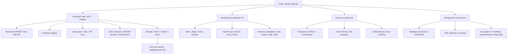

# План навчання та розвитку студента (Комп’ютерна інженерія)
**Трек:** Full-Stack (.NET + Angular)  
**Фокусні напрями:** методологія розробки, контроль версій, методологія тестування

---

## 👇 Візуальна схема (Mermaid)

---

## 🎯 Цілі програми

* Сформувати стійкі **інженерні навички** від аналізу вимог до продакшн-деплою.
* Опанувати **.NET + Angular** як повноцінний full-stack стек.
* Впевнено користуватися **Git**, **CI/CD**, **тестуванням** і **контейнерами**.
* Зібрати **портфоліо** з 2-3 практичних проєктів.

---

## Семестровий роадмап (4× ~16 тижнів)

### Семестр 1 — Фундаменти

* **Компетенції**

  * Комп’ютерні мережі (OSI/TCP-IP, HTTP, DNS), ОС та термінал.
  * Програмування на **C#**: синтаксис, ООП, колекції, LINQ, async/await.
  * **Git**: init/clone/commit/branch/merge/rebase, конфлікти, `.gitignore`.
  * **Методологія розробки**: SDLC, Agile/Scrum, user stories, DoD/DoR, Kanban.
  * **Тестування — основи**: типи тестів, піраміда, якість, інструменти.
* **Практика**

  * Курсова: **CLI-утиліта/міні-бібліотека C#** з юніт-тестами (xUnit).
  * Налаштування GitHub/GitLab, перший **Pull Request** і code review.
* **Очікуваний результат**

  * Вміння самостійно написати й покрити тестами невеликий модуль.
  * Розуміння процесів командної розробки.

---

### Семестр 2 — Backend на ASP.NET Core

* **Компетенції**

  * **ASP.NET Core Web API**, контролери, middleware, конфігурації.
  * **REST**: ресурси, статус-коди, пагінація, фільтри, версіонування.
  * **EF Core** + **SQL (MS SQL / PostgreSQL)**: моделювання, міграції.
  * **Тестування бекенду**: unit (xUnit+Moq), інтеграційні (WebApplicationFactory), бази для тестів.
  * **Автоматизація**: Git branching strategy (GitFlow або Trunk-based), **CI** (GitHub Actions/GitLab CI) — build + tests.
* **Практика**

  * Навчальний **API “Events/Tasks”** з CRUD, авторизацією, документацією (**Swagger**).
* **Очікуваний результат**

  * Зрілі REST-ендпоїнти, адекватний data-layer, базові інтеграційні тести.

---

### Семестр 3 — Frontend на Angular

* **Компетенції**

  * **TypeScript** (типи, generics, модулі), **Angular** (компоненти, модулі, DI, роутинг).
  * **Форми** (Reactive Forms), **HTTP-клієнт**, **RxJS** (Observable, operators).
  * Стан (NgRx — опціонально), UI-бібліотека (Angular Material).
  * **Тестування фронтенду**: unit (Jasmine/Karma), **E2E** (Playwright).
  * **Документація та дизайн-система**: Storybook (опціонально).
* **Практика**

  * **SPA “Events/Tasks”** з інтеграцією до бекенду зі Семестру 2.
  * Налаштування фронт-частини в CI: лінт, юніт-тести, E2E.
* **Очікуваний результат**

  * Продуктивний SPA з формами, таблицями, пагінацією, фільтрами, охороною маршрутів.

---

### Семестр 4 — Безпека, DevOps і Продакшн

* **Компетенції**

  * **Auth & Security**: ASP.NET Identity, JWT, ролі, refresh-токени; основи **OAuth2/OIDC**.
  * **Docker**: контейнеризація API та SPA, docker-compose (API + DB + reverse proxy).
  * **CI/CD**: build, test, Docker build/push, release, **деплой** у **Azure** (App Service/Container Apps) або VPS.
  * **Спостережуваність**: логування (Serilog), метрики, **Health Checks**.
  * **Надійність**: міграції БД у пайплайні, бекапи, .env/Secrets.
* **Практика**

  * **Капстоун-проєкт**: повний цикл — від вимог і плану спринтів до продакшн-деплою з доменом/SSL.
* **Очікуваний результат**

  * Готовий продакшн кейс у портфоліо, що демонструє повний стекизм.

---

## Методологія розробки ПЗ (детально)

* **Процеси:** SDLC, Agile/Scrum (спринти, стендапи, ретро), Kanban (WIP-ліміти).
* **Артефакти:** User story, acceptance criteria, **UML** (use-case, sequence), **ADR** (Architecture Decision Record), **README**, **CHANGELOG**.
* **Архітектура:** **SOLID**, **Clean Architecture** (шари: Domain/Application/Infrastructure/API), DTO/Mapper, валідація (FluentValidation).
* **Планування:** оцінка задач (Story Points), Roadmap, Definition of Done/Ready.
* **Командна робота:** Pull Requests, Code Review guidelines, Coding Standards (EditorConfig, analyzers).

---

## Контроль версій (Git)

* **Основи:** commit-історія, гілки, rebase vs merge, конфлікти, cherry-pick.
* **Стратегії:** **GitFlow** (release/hotfix) або **Trunk-based** (short-lived branches).
* **Практики:** Conventional Commits, семантичне версіонування, реліз-теги.
* **Інструменти:** GitHub/GitLab, protected branches, required reviews, CI hooks.

---

## Методологія тестування

* **Піраміда тестів:** Unit → Integration → E2E → (Contract/Performance за потреби).
* **Back-end:** xUnit, **Moq** / NSubstitute, **Testcontainers** (опц.) для інтеграцій з БД.
* **Front-end:** Jasmine/Karma для unit, **Playwright** для E2E.
* **Підходи:** **TDD/ATDD**, тест-дані (Bogus), **coverage thresholds**, flaky-тести й стабільність.
* **CI інтеграція:** автозапуск тестів, артефакти репортів, якорі “не ламай main”.

---

## Стек і інструменти

### Backend (.NET)

* **C# 12/13**, **ASP.NET Core Web API**, **EF Core**, **Serilog**, **FluentValidation**, **Swagger/NSwag**.
* **БД:** MS SQL або PostgreSQL; **Migrations**; індекси, плани виконання (базово).

### Frontend (Angular)

* **Angular 17+**, **TypeScript**, **RxJS**, **Angular Material**, **SCSS**.
* Інтернаціоналізація (i18n), lazy-loading, оптимізація білду.

### DevOps

* **Docker**, docker-compose; **Nginx**/Caddy як reverse-proxy.
* **CI/CD:** GitHub Actions/GitLab CI (build → test → docker build/push → deploy).
* **Хмара:** **Azure App Service/Container Apps**, Azure SQL/Postgres, Key Vault (секрети).

---

## Проєкти та портфоліо

1. **Семестр 2:** REST API “Events/Tasks” + Swagger, JWT, EF Core, unit/integration.
2. **Семестр 3:** SPA до API (Angular), таблиці/форми/фільтри, unit + E2E.
3. **Семестр 4 (Капстоун):** продакшн-деплой з доменом/HTTPS, CI/CD, логування, health checks.

---

## Оцінювання (рекомендація)

* **Тести/Лаби:** 30% (unit/integration/E2E, покриття, якість коду)
* **Міні-проєкти:** 40% (функціональність, архітектура, Git-історія, PR-якість)
* **Капстоун:** 30% (повний цикл, DevOps, стабільність у продакшені)

---

## Щотижнева рутина студента

* 2–3 год **чистого коду** (без відволікань).
* 1 год **читання/конспект** (документація, ADR, статті).
* 1 год **тести** (написання/рефакторинг).
* 1 PR на тиждень у навчальний репозиторій + code review.

---

## Додатково (опційно)

* **Патерни** (GoF), **DDD** (базово), **CQRS/MedatR**, **OpenAPI-first**.
* **Безпека:** OWASP Top-10, валідація/санітизація, секрети.
* **Мобільність:** PWA або Capacitor (за інтересом).
* **Інструменти:** Postman/Insomnia, Docker Desktop, Azure Portal, VS Code/JetBrains.
* **Soft skills:** комунікація, тайм-менеджмент, робота в команді.
