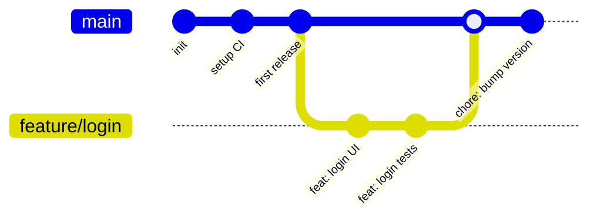
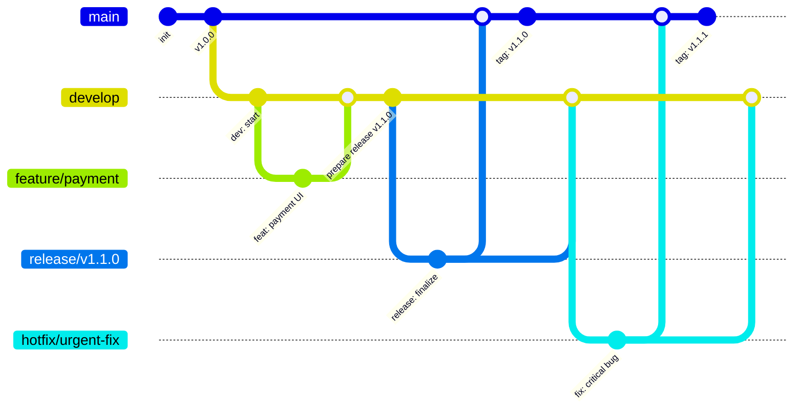
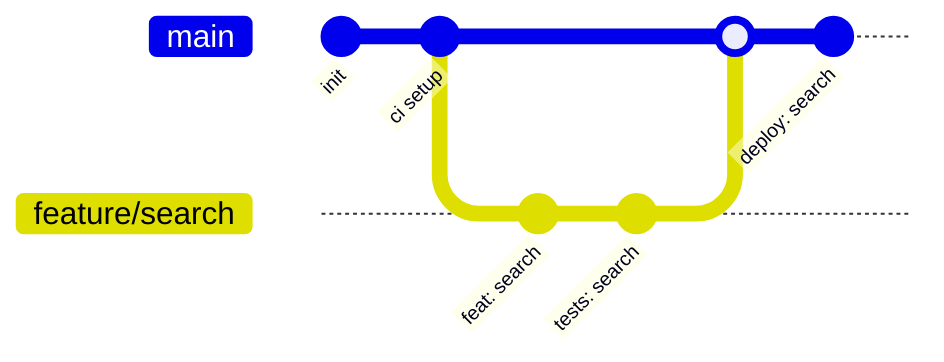

# Git Branching Strategies

This document compares several widely used branching strategies: Trunk-Based Development, Git Flow, and other popular workflows (GitHub Flow / GitLab Flow). Each section includes a short explanation, pros/cons, and a small mermaid diagram demonstrating a typical lifecycle.

---

## Trunk-Based Development

Trunk-Based Development (TBD) emphasizes a single long-lived branch (commonly `main` or `trunk`) where developers frequently integrate small, incremental changes. Feature work is usually done in short-lived branches or feature toggles are used to keep unfinished work off in production.

When to use

- High-performing teams practicing continuous integration and continuous delivery.
- Teams that prefer frequent deployments and smaller merges.

Pros

- Simplifies integration and reduces merge conflicts.
- Encourages small, frequent releases.

Cons

- Requires strong CI/CD and feature toggling practices.
- Risk of instability if feature flags are not used correctly.

Example (real-case): small feature branch merged to `main` after CI passes.

---

## Git Flow

Git Flow is a more prescriptive model introduced by Vincent Driessen. It uses multiple long-lived branches (`main` and `develop`) and special supporting branches: `feature/*`, `release/*`, `hotfix/*`, and `support/*`.

When to use

- Projects with scheduled releases and multiple parallel release lines.
- Teams that need clear separation of development vs production-ready code.

Pros

- Clear policy for releases and hotfixes.
- Suited for larger teams with release managers.

Cons

- More complex; merge policy overhead.
- Not ideal for rapid continuous deployment.

Example (real-case): feature development, release branch creation, hotfix to production.

---

## GitHub Flow (and similar lightweight flows)

GitHub Flow is a lightweight workflow centered on `main` with short-lived feature branches and pull requests. It's simpler than Git Flow and optimized for continuous deployment.

When to use

- Web apps with frequent releases and trunk-based CI pipelines.
- Teams that rely on PR reviews and automated testing.

Pros

- Simple and easy to follow.
- Good for fast-paced product teams.

Cons

- Less structure for complex release policies.

Example (real-case): feature PR and deployment after merge.

---

## Choosing a Strategy

- Use Trunk-Based or GitHub Flow if you aim for frequent releases and a strong CI/CD pipeline.
- Use Git Flow when you need explicit release management and isolated hotfix procedures.
- You can mix the strategies: e.g., use Git Flow branching topology but integrate continuously for fast teams.

---

## Real-case Scenarios and Tips

- Large enterprise with multiple release tracks: Git Flow (or a variant) with `support/*` branches for long-term maintenance.
- Startups shipping daily: Trunk-Based + feature flags; keep branches short-lived (<1 day ideally).
- Emergency fixes: create `hotfix/*` or short-lived `fix/*` branch directly off `main`, apply fix, tag and merge back to `develop`/`main` as needed.

### Tips

- Keep pull requests small and focused.
- Automate merges when CI passes and approvals are met.
- Prefer rebase-and-merge for linear history in TBD/GitHub Flow, and merge commits for Git Flow if that helps traceability.

